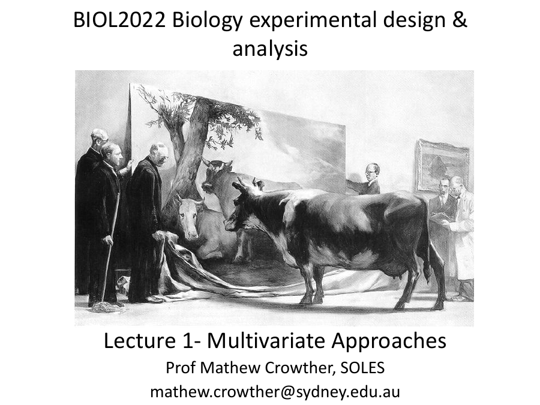
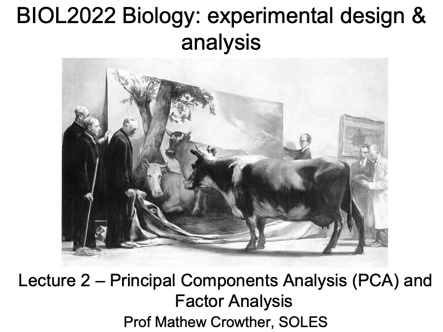

::: {.lecture-actions}
**Tuesday: Introduction to multivariate analysis** [<i class="bi bi-box-arrow-up-right" aria-hidden="true"></i> Open in Canvas](https://canvas.sydney.edu.au/courses/74353/pages/week-09-tue-introduction-to-multivariate-analysis){.lecture-action target="_blank" rel="noopener noreferrer"}
:::

::: {.content-visible when-format="html"}
```{=html}
<a href="https://canvas.sydney.edu.au/courses/74353/pages/week-09-tue-introduction-to-multivariate-analysis" class="lecture-deck-preview lecture-deck-image" target="_blank" rel="noopener noreferrer">
  
</a>
```
:::

::: {.lecture-actions}
**Wednesday: Principal Component Analysis (PCA) and Factor Analysis (FA)** [<i class="bi bi-box-arrow-up-right" aria-hidden="true"></i> Open in Canvas](https://canvas.sydney.edu.au/courses/74353/pages/week-09-wed-principal-component-analysis-pca-and-factor-analysis-fa){.lecture-action target="_blank" rel="noopener noreferrer"}
:::

::: {.content-visible when-format="html"}
```{=html}
<a href="https://canvas.sydney.edu.au/courses/74353/pages/week-09-wed-principal-component-analysis-pca-and-factor-analysis-fa" class="lecture-deck-preview lecture-deck-image" target="_blank" rel="noopener noreferrer">
  
</a>
```
:::

::: {.lecture-week-nav}
[← Week 8: Model selection and revision](../L08/index.qmd){.lecture-previous}

[Week 10: Clustering and multidimensional scaling →](../L10/index.qmd){.lecture-next}
:::
