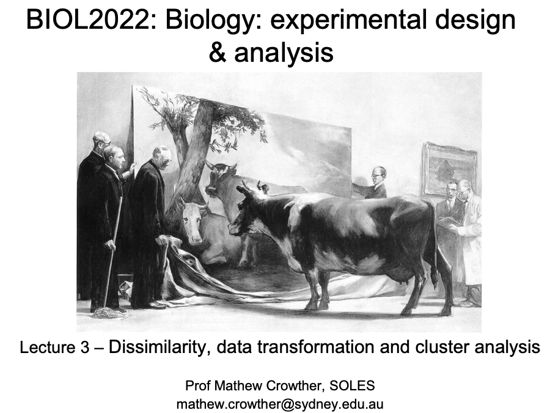
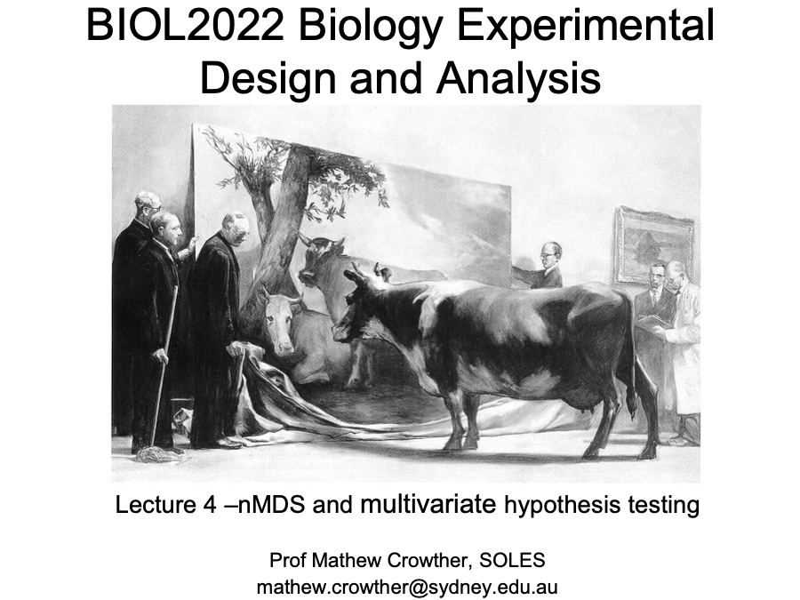

::: {.lecture-actions}
**Tuesday: Clustering** [<i class="bi bi-box-arrow-up-right" aria-hidden="true"></i> Open in Canvas](https://canvas.sydney.edu.au/courses/74353/pages/week-10-tue-clustering){.lecture-action target="_blank" rel="noopener noreferrer"}
:::

::: {.content-visible when-format="html"}
```{=html}
<a href="https://canvas.sydney.edu.au/courses/74353/pages/week-10-tue-clustering" class="lecture-deck-preview lecture-deck-image" target="_blank" rel="noopener noreferrer">
  
</a>
```
:::

::: {.lecture-actions}
**Wednesday: Non-metric multi-dimensional scaling (nMDS) and hypothesis testing** [<i class="bi bi-box-arrow-up-right" aria-hidden="true"></i> Open in Canvas](https://canvas.sydney.edu.au/courses/74353/pages/week-10-wed-non-metric-multi-dimensional-scaling-nmds-and-hypothesis-testing){.lecture-action target="_blank" rel="noopener noreferrer"}
:::

::: {.content-visible when-format="html"}
```{=html}
<a href="https://canvas.sydney.edu.au/courses/74353/pages/week-10-wed-non-metric-multi-dimensional-scaling-nmds-and-hypothesis-testing" class="lecture-deck-preview lecture-deck-image" target="_blank" rel="noopener noreferrer">
  
</a>
```
:::

::: {.lecture-week-nav}
[← Week 9: Multivariate analysis and PCA](../L09/index.qmd){.lecture-previous}

[Week 11: MANOVA and multivariate revision →](../L11/index.qmd){.lecture-next}
:::
