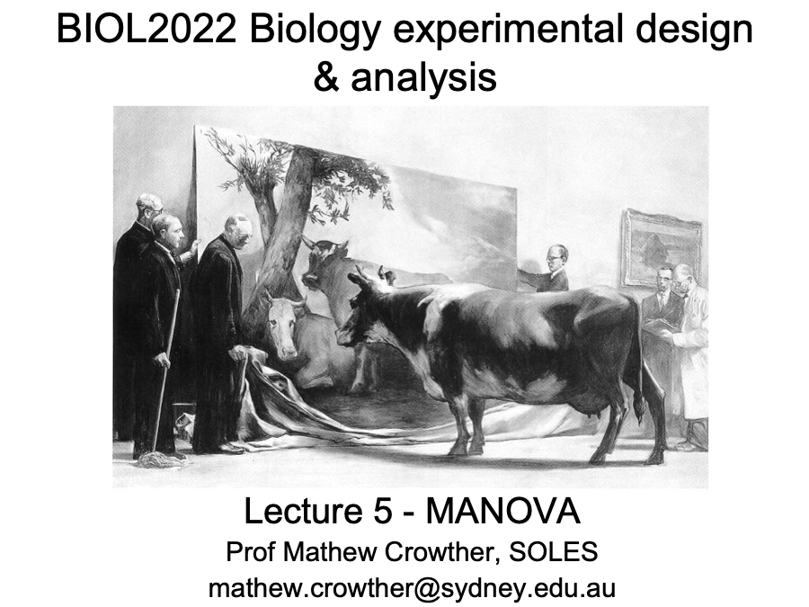

::: {.lecture-actions}
**Tuesday: Multivariate analysis of variance (MANOVA)** [<i class="bi bi-box-arrow-up-right" aria-hidden="true"></i> Open in Canvas](https://canvas.sydney.edu.au/courses/74353/pages/week-11-tue-multivariate-analysis-of-variance-manova){.lecture-action target="_blank" rel="noopener noreferrer"}
:::

::: {.content-visible when-format="html"}
```{=html}
<a href="https://canvas.sydney.edu.au/courses/74353/pages/week-11-tue-multivariate-analysis-of-variance-manova" class="lecture-deck-preview lecture-deck-image" target="_blank" rel="noopener noreferrer">
  
</a>
```
:::

::: {.lecture-actions}
**Wednesday: Multivariate revision 1** [<i class="bi bi-box-arrow-up-right" aria-hidden="true"></i> Open in Canvas](https://canvas.sydney.edu.au/courses/74353/pages/week-11-wed-multivariate-revision-1){.lecture-action target="_blank" rel="noopener noreferrer"}
:::

::: {.content-visible when-format="html"}
```{=html}
<a href="https://canvas.sydney.edu.au/courses/74353/pages/week-11-wed-multivariate-revision-1" class="lecture-deck-preview" target="_blank" rel="noopener noreferrer">
  <span class="lecture-deck-title">Materials will appear in Canvas</span>
  <span class="lecture-deck-utility">Opens in Canvas</span>
</a>
```
:::

::: {.lecture-week-nav}
[← Week 10: Clustering and multidimensional scaling](../L10/index.qmd){.lecture-previous}

[Week 12: Rarefaction and Bayesian analysis →](../L12/index.qmd){.lecture-next}
:::
