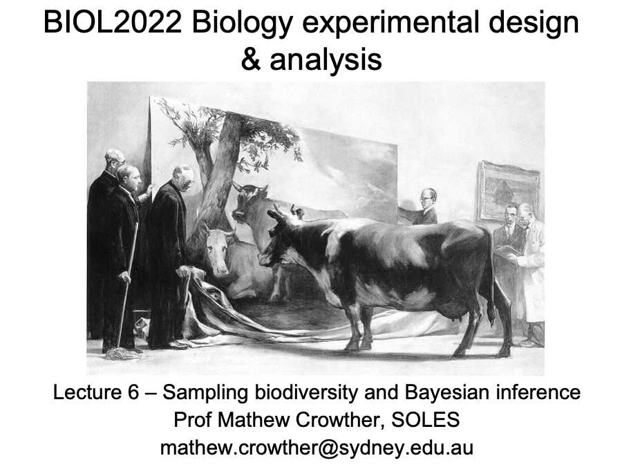

::: {.lecture-actions}
**Tuesday: Rarefaction and Bayesian analysis** [<i class="bi bi-box-arrow-up-right" aria-hidden="true"></i> Open in Canvas](https://canvas.sydney.edu.au/courses/74353/pages/week-12-tue-rarefaction-and-bayesian-analysis){.lecture-action target="_blank" rel="noopener noreferrer"}
:::

::: {.content-visible when-format="html"}
```{=html}
<a href="https://canvas.sydney.edu.au/courses/74353/pages/week-12-tue-rarefaction-and-bayesian-analysis" class="lecture-deck-preview lecture-deck-image" target="_blank" rel="noopener noreferrer">
  
</a>
```
:::

::: {.lecture-actions}
**Wednesday: Multivariate revision 2** [<i class="bi bi-box-arrow-up-right" aria-hidden="true"></i> Open in Canvas](https://canvas.sydney.edu.au/courses/74353/pages/week-12-wed-multivariate-revision-2){.lecture-action target="_blank" rel="noopener noreferrer"}
:::

::: {.content-visible when-format="html"}
```{=html}
<a href="https://canvas.sydney.edu.au/courses/74353/pages/week-12-wed-multivariate-revision-2" class="lecture-deck-preview" target="_blank" rel="noopener noreferrer">
  <span class="lecture-deck-title">Materials will appear in Canvas</span>
  <span class="lecture-deck-utility">Opens in Canvas</span>
</a>
```
:::

::: {.lecture-week-nav}
[← Week 11: MANOVA and multivariate revision](../L11/index.qmd){.lecture-previous}

[Week 13: Exam revision →](../L13/index.qmd){.lecture-next}
:::
