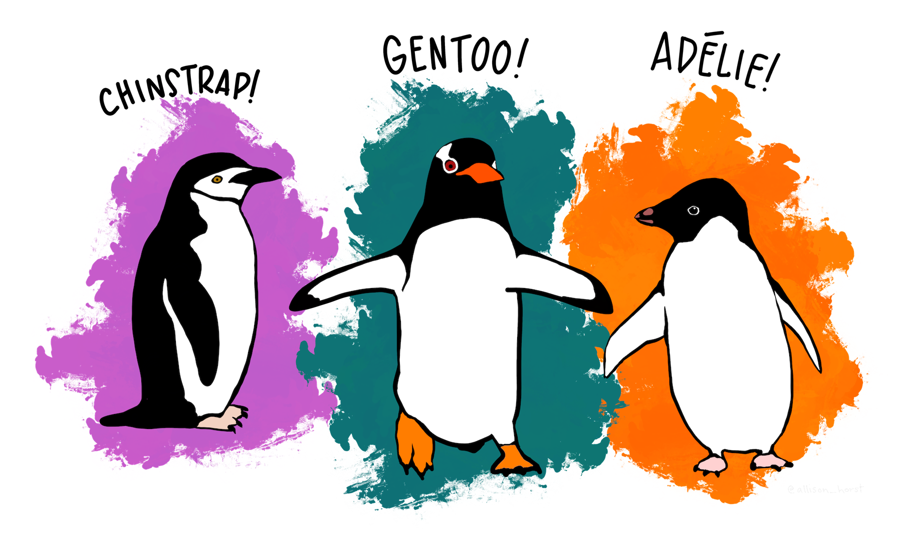

## Introduction {.unnumbered}

Welcome to your first BEDA practical. This week, you will get familiar with the tools and approaches you will use throughout the semester. You will also have time to explore the software and support resources before completing your first modelling task: using a graphical model to communicate your ideas, even when you do *not* yet have a statistical model to fit.

### Before the practical {.unnumbered}

1. Attend or watch the Week 1, Tuesday lecture. **This is essential.**
2. Read through this practical before class. You will have a better experience if you are familiar with the tasks. **You do not need to complete anything in advance, but reading ahead will help you plan your time and know what to expect.**
3. Bring a laptop. Ideally, install your chosen software before the practical, but you can also install it during the session.
4. Bring a pen or pencil for your lab notebook. You will use it to sketch ideas, annotate figures, and quickly record decisions during activities.

::: {.column-margin}
<i class="bi bi-info-circle me-1" aria-hidden="true"></i> **Note:** Please avoid asking AI to summarise this practical before you have read it yourself. You need to develop crictical skills in reasoning which often requires you to engage directly with the material and tasks. It takes about 5 minutes to read, and doing so will help you understand what you do (and do not) know, and you can ask for the right help during the practical.
:::

::: {.callout-important}
### Download the Week 1 datasets

Download both files before you begin and keep their filenames unchanged:

- [Download **penguins.csv**](https://canvas.sydney.edu.au/courses/74353/files/51697284/download?download_frd=1)
- [Download **possums.xlsx**](https://canvas.sydney.edu.au/courses/74353/files/51697285/download?download_frd=1)

If the links do not work, you can also download the files from Canvas - click on Module Content and Resources.
:::

### Learning outcomes {.unnumbered}

By the end of this practical, you should be able to:

::: {.learning-outcomes-table}
| Learning outcome | How you will practise it |
|---|---|
| Formulate a **measurable** biological question from observations or available data. | Turn observations about penguins into questions, then formulate your own question using variables from another dataset on possums. |
| Distinguish response and predictor **variables** and classify them by data type. | Classify variables, form biologically meaningful pairs and identify what you want to explain and what might explain it. |
| Explain how decisions made during **study design** shape the models that can be used. | Compare age recorded as categories with age measured continuously, then consider how measuring or classifying your own variables differently would change the model. |
| Use a **graphical model** to communicate an expected biological relationship *before* analysing data. | Choose and justify an appropriate plot, label both axes and sketch a plausible relationship in your lab notebook. |
:::


## Workshop
We will begin with a short workshop to get you started with the software and the empirical modelling approach. You will then apply the same reasoning to complete the practical tasks.


### Pick your software (15 min)

**If you are new to statistical software, please choose Jamovi.** That said, we will support your use of SPSS and R (we have experts in either roaming the practicals), although we strongly suggest using Jamovi if you are an SPSS user.

::: {.column-margin}
<i class="bi bi-info-circle me-1" aria-hidden="true"></i> **Note:** If you use other software, we assume that you are already familiar with it and can complete the practical tasks independently.
:::


::: {.panel-tabset}
#### Jamovi

1. Go to the [Jamovi download page](https://www.jamovi.org/download.html){target="_blank" rel="noopener noreferrer"}.
2. Download the current **Desktop** version for your operating system.
3. Open the downloaded installer and follow the prompts. On macOS, open the `.dmg` file and move Jamovi to your Applications folder.
4. Open Jamovi.

<!-- Follow the [Install Jamovi cheatsheet](https://usyd-soles-edu.github.io/cheatsheets/jamovi/getting-started/){target="_blank" rel="noopener noreferrer"} for the full setup guide. -->

#### R/RStudio

R and RStudio are separate programs. **Install R first, then install RStudio.**

1. Download R for [Windows](https://cran.r-project.org/bin/windows/base/){target="_blank" rel="noopener noreferrer"} or [macOS](https://cran.r-project.org/bin/macosx/){target="_blank" rel="noopener noreferrer"}. On a Mac, choose the installer that matches Apple silicon or Intel.
2. Open the R installer and accept the default options.
3. Download the free version of [RStudio Desktop](https://posit.co/download/rstudio-desktop/){target="_blank" rel="noopener noreferrer"} for your operating system.
4. If necessary, you may sign up to [Posit Cloud](https://posit.cloud/) and use RStudio in a web browser, but you may fare better by installing Positron (see the next tab).

<!-- Follow the [Install R with RStudio or Positron cheatsheet](https://usyd-soles-edu.github.io/cheatsheets/r/getting-started/){target="_blank" rel="noopener noreferrer"} and choose the RStudio route. -->

#### R/Positron

R and Positron are separate programs. **Install R first, then install Positron.**

1. Download and install R for [Windows](https://cran.r-project.org/bin/windows/base/){target="_blank" rel="noopener noreferrer"} or [macOS](https://cran.r-project.org/bin/macosx/){target="_blank" rel="noopener noreferrer"}. Positron requires R 4.2 or later.
2. Go to the [Positron download page](https://positron.posit.co/download.html){target="_blank" rel="noopener noreferrer"}.
3. Choose the installer for your computer. On a Snapdragon-based Windows 11 laptop, choose **Windows arm64**. If you do not have administrator access, choose the Windows **user-level** installer.
4. Install and open Positron. If prompted, select the R installation you just installed.

<!-- Follow the [Install R with RStudio or Positron cheatsheet](https://usyd-soles-edu.github.io/cheatsheets/r/getting-started/){target="_blank" rel="noopener noreferrer"} and choose the Positron route. -->

:::


### A simple modelling exercise (10 min)

**What is in a question?** When we see an interesting pattern and want to investigate it, we need to be able to ask questions that can be addressed with data. Let's start with a familiar example.



The above are simple illustrations of the three penguin species in the `penguins.csv` dataset. Suppose we were, in fact, scientists on a research expedition to the Palmer Archipelago of Antarctica, and we saw these cartoon penguins. *They're not moving, all we see are their shapes and sizes, and we happen to observe that there are at least three species*. What interesting observations might we make about them? How could we turn those observations into a question that can be addressed with data? In most cases, we would look for **measurable differences**, which are often data that can be expressed as numbers. For example, we might notice that the penguins have different bill shapes and sizes. We could measure the bill length and depth of each penguin, then ask a question about how those measurements differ among species.


To be able to recognise data that we can measure, we need to be able to identify the **response** and **predictor** variables in a question. What is a response variable? What is/are predictor variables?

Let's assume that we have obtained the `penguins.csv` dataset, which contains measurements of penguin bill length and depth, flipper length, body mass, species, sex and island, because we had **questions about how those variables are related**. Can we back-track from the data to the questions that might have motivated the collection of those data?

We will, as a class, come up with a few questions based on the dataset. In this workshop we will also use both Jamovi and R to explore and model two of those questions to give everybody an idea of what modelling is about.


### Introduction to cheatsheets (5 min)

In the final part of the workshop, we will introduce cheatsheets, which are quick reference guides that we have developed for the past few years to guide you, and you digital assistants (if you choose to, *cough* AI *cough*), through the software. We hope that this makes the purpose of BEDA clear -- software should be the *least* of your worries in BEDA and it is most important to retain the knowledge of how to **think about the data and the questions you are asking** as these are the skills that will be most useful to you in your future careers. Software and techniques, on the other hand, are tools that change over time and are less important to retain.

We will vote on a cheatsheet to demonstrate in the workshop. You will work on cheatsheets again in the practical.


## Practical

You will now work in pairs to complete the practical exercises. Your demonstrators will roam the room and check in with you to see how you are going. If you have any questions, please ask them! **Demonstrators will check each of your exercises to ensure that you are on the right track.**

### Exercise 1: Cheatsheets
This exercise is designed to get you familiar with the cheatsheets and how to use them. You will be asked to complete a few tasks using the cheatsheets and your chosen software.

#### Your task
1. Open Cheatsheets.
2. Choose **two (2)** cheatsheet that you are not familiar with and see if you can create the outputs that they describe.
3. Save those outputs. A demonstrator will check your work and give you feedback.

::: {.column-margin}
<i class="bi bi-info-circle me-1" aria-hidden="true"></i> **Note:** If you have never used Jamovi before, now is a good time to try it.
:::

### Exercise 2: Data types

In this exercise you will work on the [**possums.xlsx**](https://canvas.sydney.edu.au/courses/74353/files/51697285/download?download_frd=1) dataset. If you have not already downloaded it, do that now and open it in your chosen software.

#### Your task
1. Carefully read the "Metadata" and "AllPossData" sheets in the MS Excel file. The metadata sheet describes the variables in the dataset and their units of measurement. The AllPossData sheet contains the actual data.
2. Choose six variables, including at least two continuous variables and two categorical variables. Classify each variable and record its type in your lab notebook. Some variables may have more than one reasonable classification.
3. Use those variables to identify two biologically meaningful pairs: one containing a continuous and a categorical variable, and another containing two continuous variables. You will choose one of these pairs for Exercise 3.

::: {.column-margin}
<i class="bi bi-info-circle me-1" aria-hidden="true"></i> **Note:** It is entirely possible that a variable can be classified as more than one type. For example, a variable may be continuous and ordinal, or categorical and binary. If you are unsure about the classification of a variable, please ask a demonstrator for help. This is important as data classification is a key step in the modelling process.
:::

##### Data types

| Data type | What it means |
|---|---|
| Continuous | A numeric measurement that can take many values |
| Discrete | A numeric count with whole-number values |
| Categorical (nominal) | A label or group with *no natural order* |
| Ordinal | A category with a *meaningful* order |
| Binary | A categorical variable with *two levels* |


### Exercise 3: Modelling basics

In this exercise you will use Jamovi or R to model relationships between variables in the **possums.xlsx** dataset, with the goal of answering the questions you formulated in Exercise 2. No statistics are required for this exercise, but you will use graphical plots to visualise the models.

**What is the point?** A model is just a simple way to represent something complicated. In data analysis, a model helps us make sense of a dataset, test ideas (hypotheses), or make predictions. Models can be as simple or as fancy as you like, depending on your data and your research question.

Soon, you will start using empirical models to describe relationships between variables. We will write these relationships using simple notation, such as $y \sim x$. We won't do that just yet; for now, we will plot the data.

#### If you can **plot** it, you are already **modelling** it
For now, let us focus on graphical models – in other words, plots! Plots are models because they show relationships between variables.

For example, you could plot the daily sleep time of dogs against their age to see if there is a pattern. **It does not matter what pattern you show when coming up with a model**. Younger and older dogs might sleep for similar amounts of time, or one group might sleep longer than the other. These possibilities could look like this:

```{r}
#| label: fig-dog-sleep-age-groups
#| fig-cap: "Four possible patterns in daily sleep time between younger and older dogs."
#| fig-subcap:
#|   - "Similar sleep time between age groups."
#|   - "Older dogs sleep longer."
#|   - "Younger dogs sleep longer."
#|   - "Greater variation in sleep time among older dogs."
#| fig-alt: "Four separate boxplots arranged in a two-by-two grid. They show similar sleep time between age groups, longer sleep among older dogs, longer sleep among younger dogs, and greater variation among older dogs."
#| layout-ncol: 2
#| fig-width: 4.2
#| fig-height: 3.8
#| echo: false

library(ggplot2)

set.seed(2022)

make_sleep_data <- function(
  younger_mean,
  older_mean,
  younger_sd = 1,
  older_sd = 1
) {
  data.frame(
    Age_group = factor(
      rep(c("Younger", "Older"), each = 20),
      levels = c("Younger", "Older")
    ),
    Sleep_hours = c(
      rnorm(20, mean = younger_mean, sd = younger_sd),
      rnorm(20, mean = older_mean, sd = older_sd)
    )
  )
}

make_sleep_plot <- function(data) {
  ggplot(data, aes(x = Age_group, y = Sleep_hours)) +
    geom_boxplot(
      width = 0.55,
      outlier.shape = NA,
      fill = "#eeebf7",
      colour = "#332b5c",
      linewidth = 0.9
    ) +
    coord_cartesian(ylim = c(5, 17)) +
    labs(
      x = "Age group",
      y = "Sleep (hours/day)"
    ) +
    theme_classic(base_size = 18) +
    theme(
      axis.text = element_text(
        colour = "#222222",
        size = 15
      ),
      axis.title = element_text(
        colour = "#222222",
        size = 16
      ),
      axis.line = element_line(
        colour = "#222222",
        linewidth = 0.8
      ),
      plot.margin = margin(10, 10, 10, 10)
    )
}

similar_sleep <- make_sleep_plot(
  make_sleep_data(younger_mean = 10.5, older_mean = 10.5)
)
older_sleep_longer <- make_sleep_plot(
  make_sleep_data(younger_mean = 9, older_mean = 13)
)
younger_sleep_longer <- make_sleep_plot(
  make_sleep_data(younger_mean = 13, older_mean = 9)
)
older_sleep_varies <- make_sleep_plot(
  make_sleep_data(
    younger_mean = 10.5,
    older_mean = 10.5,
    younger_sd = 0.5,
    older_sd = 2
  )
)

similar_sleep
older_sleep_longer
younger_sleep_longer
older_sleep_varies
```

Each plot represents a different possible relationship but they all use the same response and predictor variables. The response is daily sleep time in hours, and the predictor is age group (younger or older) - a categorical variable.

Interestingly, how we consider our variables can drastically change the type of plot and model used for data analysis. For example, consider the same relationship as above, **but while planning the study, we decide to record the exact age of each dog in years**. Now, age is a continuous variable, and we can use a scatterplot to show how daily sleep time changes across the age range:

```{r}
#| label: fig-dog-sleep-age-continuous
#| fig-cap: "One possible relationship between daily sleep time and age in dogs."
#| fig-alt: "Scatterplot of daily sleep time in hours against dog age in years, showing a moderate increase in sleep time across the age range."
#| echo: false
#| message: false

dog_age_example <- data.frame(
  Age_years = runif(35, min = 0.5, max = 14)
)
dog_age_example$Sleep_hours <- 9.5 +
  0.25 * dog_age_example$Age_years +
  rnorm(35, mean = 0, sd = 1)

ggplot(dog_age_example, aes(x = Age_years, y = Sleep_hours)) +
  geom_point(
    colour = "#49368c",
    size = 3
  ) +
  labs(
    x = "Age (years)",
    y = "Sleep (hours/day)"
  ) +
  geom_smooth(
    method = "lm",
    colour = "#332b5c",
    linewidth = 0.9,
    se = FALSE
  ) +
  theme_classic(base_size = 17) +
  theme(
    axis.text = element_text(
      colour = "#222222",
      size = 14
    ),
    axis.title = element_text(
      colour = "#222222",
      size = 16
    ),
    axis.line = element_line(
      colour = "#222222",
      linewidth = 0.8
    )
  )
```

In the scatterplot, the exact ages are retained, making it easier to see how daily sleep time changes across the age range. The boxplots and scatterplot use the same response and predictor, but treating age as categorical or continuous changes what the plot shows and how we interpret the relationship.

#### Your task

Your goal is to practise thinking like a research biologist. Complete all five steps below for **one biological question and one graphical model**. You do not need to process or analyse the data. Knowing the variable types is enough to choose and sketch an appropriate plot.

1. **Choose a variable pair.** Return to the two pairs you identified in Exercise 2 and choose one for this exercise.

2. **Formulate a research question.** Choose variables that could address a simple biological question. Identify the response variable, the predictor variable and the type of each variable.

3. **Choose a plot.** Match the plot to your question and variable types:

   - **Histogram:** Shows the distribution of one continuous variable. Use it when your question concerns the shape or spread of a single measurement.
   - **Scatterplot:** Shows the relationship between two continuous variables.
   - **Boxplot:** Compares a continuous response across the groups of a categorical predictor.
   - **Bar chart:** Compares counts, proportions or another summary across categories.

4. **Sketch your graphical model.** In your lab notebook, write your research question and draw the plot you expect to see. Label both axes and show a plausible pattern. The sketch represents your idea; it does not need to match the data.

5. **Explain your model.** State the relationship in words and explain why the plot suits your variables. Consider whether a different way of measuring or classifying one variable would change the plot you use. Discuss your reasoning with your partner or demonstrator.

::: {.callout-important}
#### What to show your demonstrator

Your lab notebook should contain:

- your biological question;
- the response and predictor variables, including their types;
- a labelled sketch of the plot;
- the expected relationship stated in words; and
- a brief explanation of why the plot is suitable.

You do not need to fit or test a statistical model.
:::

### Consolidation

The three exercises follow the same reasoning that you will use throughout BEDA:

**Biological question** → **variables** → **data types** → **graphical model** → **model in words**

Before you finish, show your graphical model to another student. Without looking at the dataset, can they identify what you are trying to explain, what might explain it and the pattern you expect? If not, revise the question, labels or sketch until the relationship is clear.

::: {.callout-note}
#### The main idea

A plot is not just something produced after an analysis. It represents how you think the variables may be related. These early decisions also guide the statistical model you will eventually choose and fit.
:::
