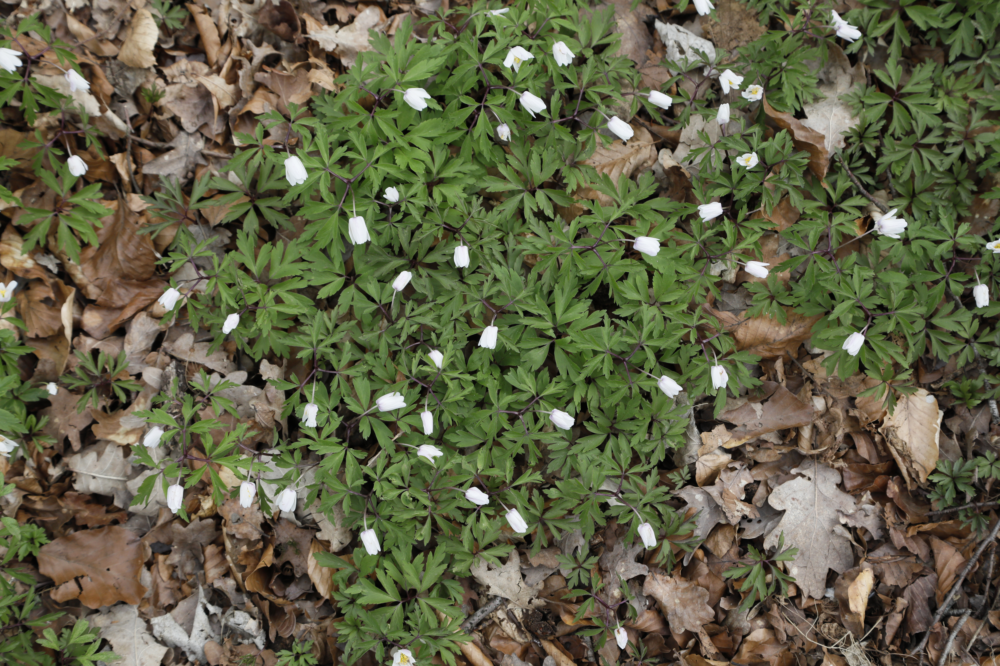
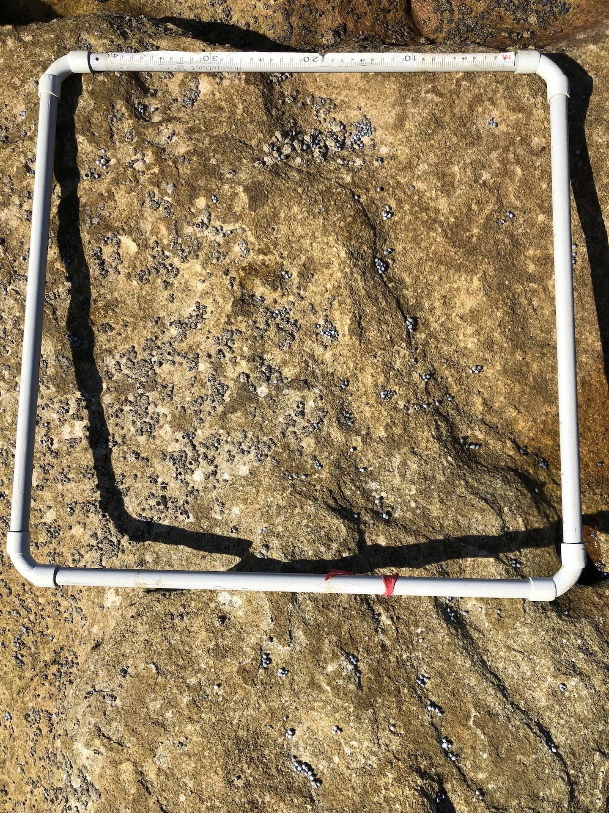
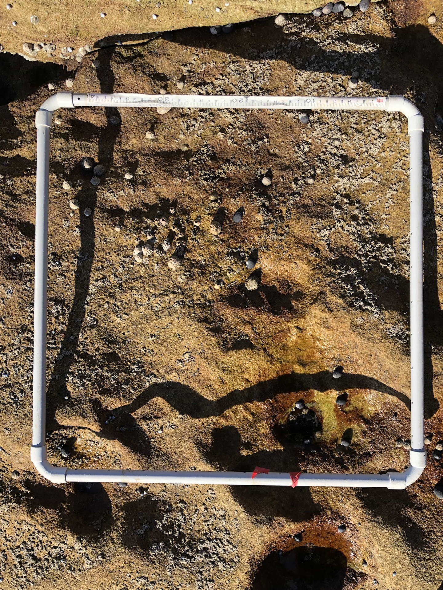
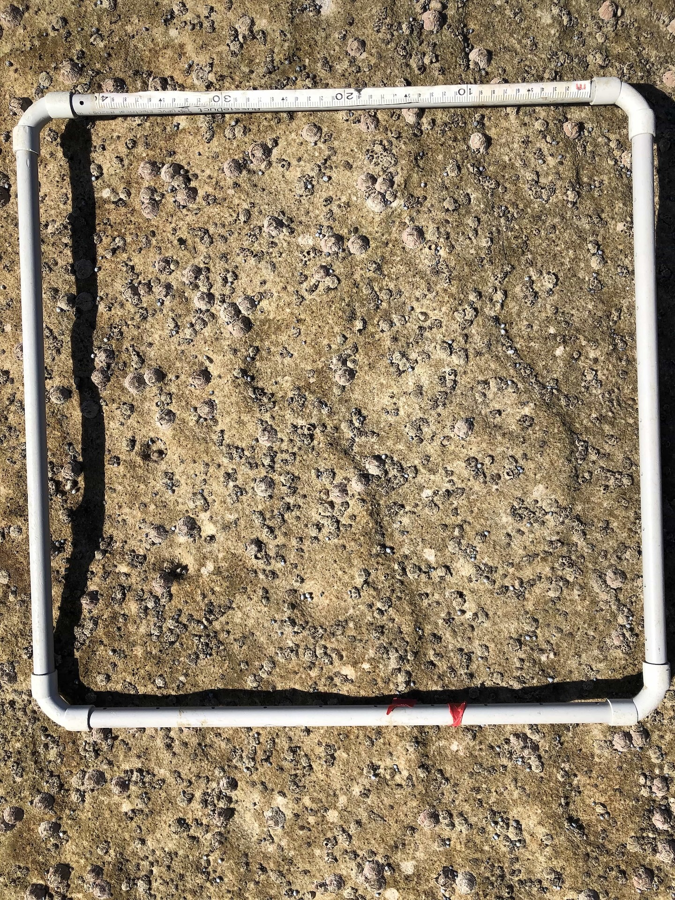
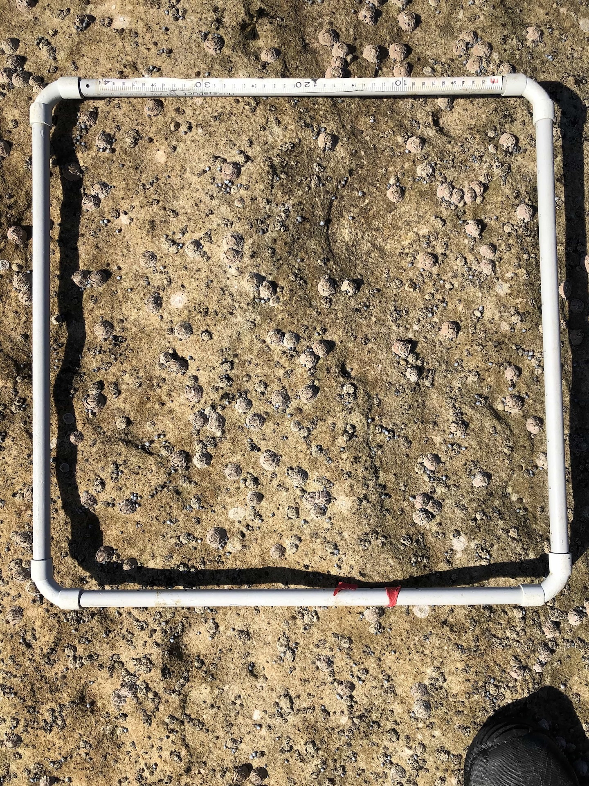
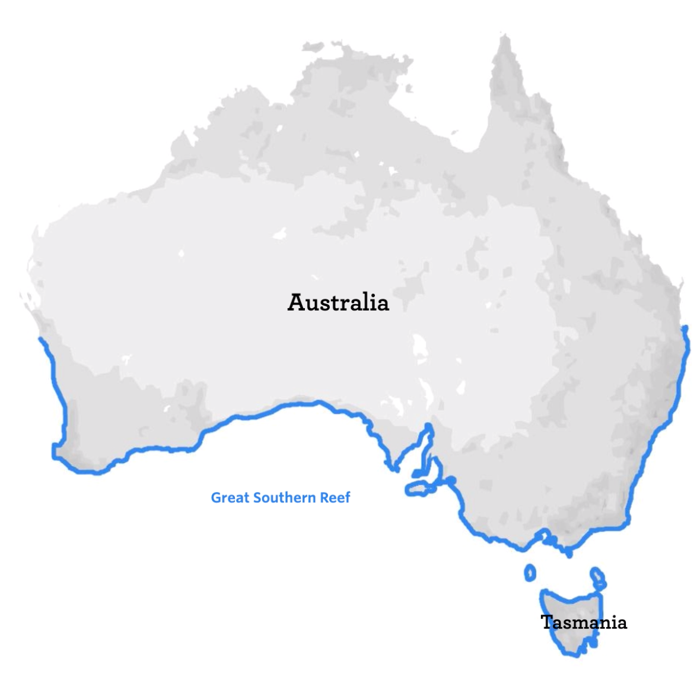

## Introduction {.unnumbered}

Today we focus on **study design and sampling**. You will work in groups of at least four students to agree on a clear plan for collecting data in the next practical.

**Spend 2 to 3 minutes now looking at the image below.** What do you see? If you notice something, how would you propose to measure it? If there are things that you need to identify, how would you go about doing that? Logistical questions like these are the first step in designing a study and help determine whether data can be collected reliably and consistently.

{fig-alt="Top-down view of a woodland floor covered by divided green foliage, scattered white nodding flowers, and brown leaf litter; no scale or quadrat is visible."}

### Things to prepare {.unnumbered}

1. [**Review Lecture 2a**](https://biol2022.github.io/2026-lectures/lectures/L02a-representative-sampling/index.html). It covers key ideas for today's practical. If you missed the lecture, please read through it beforehand so you are prepared.
2. <i class="bi bi-journal-text me-1" aria-hidden="true"></i> **Lab notebook**. Use it to jot down your observations, models, and data-collection decisions. This will help you keep track of your work.
3. **A laptop computer** with Jamovi and/or RStudio installed.
4. Have a look through the [study-design guide](https://docs.google.com/document/d/1JhSevrzpLlDsD0a4225h_dcC4i5ZOII7dkTr8u4gCgs/edit#heading=h.rc1vfwuebyac). You will use it in the practical as a scaffold.
5. **Quick links:** [Intertidal site images](105-images.qmd) and [Species identification guide](106-species-id.qmd).

::: {.callout-note appearance="simple"}
### Download the Week 2 image sets {.unnumbered}

This is optional, but you may download these files and unzip them if you want to work offline.

- [Download **Week 2 Site 1 photos (ZIP)**](https://canvas.sydney.edu.au/courses/74353/files/51851648/download?download_frd=1)
- [Download **Week 2 Site 2 photos (ZIP)**](https://canvas.sydney.edu.au/courses/74353/files/51851649/download?download_frd=1)

If the links do not work, you can also download the files from [Canvas - Module Content and Resources](https://canvas.sydney.edu.au/courses/74353/pages/biol2022-module-content-and-resources).
:::

### Learning outcomes {.unnumbered}

By the end of this practical, you should be able to:

::::: {.learning-outcomes-table}
| Learning outcome | How you will practise it |
|---|---|
| Develop a simple, testable **study design** from observations. | Use observations of the intertidal images to identify response and predictor **variables**, write a biological question and hypothesis, and sketch the expected relationship. |
| Apply a **standardised** measurement protocol to image-based data. | Use the physical quadrat shown in each image to define a consistent area for measurement, choose a counting or measurement rule, and apply it **consistently**. |
| Design a **defensible** sampling scheme. | Use the study-design guide to define the target population and sampling frame, independent image-level replicates, and a selection method that reduces bias and pseudoreplication. |
| Communicate a reproducible sampling plan for group data collection. | Agree on one group scheme, then write it clearly in your <i class="bi bi-journal-text me-1" aria-hidden="true"></i> notebook and upload a photo as a handoff for next week. |
::::

## A sampling primer

In this short workshop, we will explore how to sample data from a site using images. You will consider counts, presence or absence, cover, and other measurements.

We will open a brainstorming document for this exercise and share it with the class. Please contribute your ideas so that everyone can benefit from them.

Look at the four images below, two from **Site 1** and two from **Site 2**. Each photograph contains a [quadrat](https://en.wikipedia.org/wiki/Quadrat). Its interior defines the area you score or measure.

:::::: {layout-ncol=2}

{fig-alt="A square white quadrat frame resting on a dry, light-brown rock surface scattered with many small pale cone-shaped shells and some darker rounded shells gathered in the lower areas."}

{fig-alt="A square white quadrat frame on a rough, dry, light-brown rock with a small shallow wet pool in the lower section; the surface is dotted with small pale cone-shaped shells and a few dark smooth dome-shaped shells."}

{fig-alt="A square white quadrat frame on a dry, rough, light-brown rock surface covered with many small pale cone-shaped shells and tiny dark bumps."}

{fig-alt="A square white quadrat frame on a dry, rough, light-brown rock surface scattered with many small pale cone-shaped shells."}

::::::

Let's say we want to quantify the number, proportion, or cover of *something* in the images, either to compare the two sites or to describe a pattern across all the images.

**How would you start measuring?** As a class, let's discuss:

- what is measurable in the images;
- what logistical constraints we need to consider when working with images; and
- how to measure consistently across images and sites, with different members of your group.

### Try different measurements (10 min)

In your group, split into pairs and pick one site per pair. Can you come up with a **repeatable measurement rule** for each of the following options?

- **Count**. Identify and record how many visible units there are inside each image.
- **Presence/absence**. Record whether a variable is present (`1`) or absent (`0`).
- **Continuous measurement**. Measure a variable such as shell length, but only when the image includes a scale or other standardised reference. Is there one?

For each option, use your <i class="bi bi-journal-text me-1" aria-hidden="true"></i> notebook to write what you would measure and the rule you would use. **You do not need to perform the measurements yet.** Your protocol should be clear enough for someone else to follow it and get the same results. In other words, it should be reproducible.

For example, for a count:

1. Identify what you are counting (e.g., a species, a type of shell, or a substrate).
2. Define what counts as one unit (e.g., a single shell, a cluster of shells, or a patch of substrate).
3. Decide how to handle ambiguous cases (e.g., partially visible shells, overlapping shells, or shells that are too small to identify).
4. Count all units that meet your criteria within the quadrat area of the image. Or decide to count only a subset of the quadrat area.

Other useful options include the following, although we will not work through them today.

- **Percent cover**. Estimate the proportion of the quadrat area occupied by a focal species or substrate, for example using a grid or point-intercept rule.
- **Frequency across sub-quadrats**. Divide the quadrat into smaller cells and record in how many cells the focal variable appears.
- **Density**. Count individuals and report the number per unit area, for example per quadrat.
- **Richness**. Count how many different taxa or types are visible within the quadrat.
- **Ordinal score**. Assign a standardised category, such as low, medium, or high cover, using predefined thresholds.
- **Condition score**. Record a reproducible state metric, such as intact or damaged, or alive or dead if clearly identifiable.
- **Spatial position**. Record the coordinates of observations within the quadrat to analyse clustering or dispersion.

### Think about logistics (10 min)

Now imagine collecting data from 40 such images in 20 minutes. How would you organise yourselves to be efficient and consistent? You will need to think about:

- what options do you have to collect and share data as a group,
- how to ensure that you have sufficient sample size to answer your question, and
- what to do when not everyone in your group is an expert at identifying species or measuring variables.

**We will work on a brainstorming document together as a class. Please contribute your ideas to it.**

## Practical

Work in groups of four. You are now expected to independently observe a novel dataset, think about what looks interesting, and design a study to test a hypothesis. You will then agree on a **group sampling scheme** that you will use to collect data in the next practical.

You are provided with representative photographs of a common marine habitat that spans more than 8,000 km of the Great Southern Reef, the coastline along the bottom half of Australia. These images are your actual data source.

:::: {.content-visible when-format="html"}
First, open the [intertidal site images](105-images.qmd) page. You need to read it to obtain relevant background information. Then look through the [species identification guide](106-species-id.qmd).
:::::

:::: {.content-visible when-format="pdf"}
Please check the online Unit Manual for the link to the images. Your demonstrators will also be able to show you how to access the images.
::::

{width=70% fig-alt="Map showing the Great Southern Reef coastline around southern Australia."}

Work through the exercises in order. **The best models are usually the simplest,** so don't make them complicated. We are working on the logistics of data collection and project management, so statistical analysis is secondary.

### Exercise: Observe and choose a measurement (10 min)

#### <i class="bi bi-pencil-square me-1" aria-hidden="true"></i> Task 1 {.student-task}

Look through the intertidal images. In your <i class="bi bi-journal-text me-1" aria-hidden="true"></i> notebook:

1. Write **two direct observations**. These should be things you can see, stated as facts.
2. Base on the observations, write **one biological question** that you could answer with a simple study design.
3. Write the hypothesis to idenfity the variable(s) that you will need to answer your questions (it can be a form of a question or plot)
4. In one sentence, describe how you would measure the variable(s), and include units if feasible. A a quick example, you might write "... will measure the length of each shell in mm and record the site for that measurement..." for a model that associates shell length with site. 

### Exercise: Write the study design (15 min)

#### <i class="bi bi-pencil-square me-1" aria-hidden="true"></i> Task 2 {.student-task}

Open the [study-design guide](https://docs.google.com/document/d/1JhSevrzpLlDsD0a4225h_dcC4i5ZOII7dkTr8u4gCgs/edit#heading=h.rc1vfwuebyac) and work through it with your group. Use the guide as a scaffold, then write your final design in your <i class="bi bi-journal-text me-1" aria-hidden="true"></i> notebook.

As you work through the guide, you may need to do some literature review or research to work out how to carry out parts of your design. For example, you may do a quick Google search to find out how to measure the cover of a species or identify a species from a photo. You may also need to check the [species identification guide](106-species-id.qmd) for help.

Your design should state:

- the biological question;
- the response and predictor variables;
- the expected pattern or hypothesis;
- a sketch of the expected relationship, with the response variable on the y-axis and the predictor variable on the x-axis;
- the measurement and uncertainty rules; and
- the population, sampling unit, and selection method.

This is where your demonstrators can help you refine your ideas. They will make time to visit each group.

### Exercise: Finalise and share the sampling scheme (30 min)

Do you have a clear plan for collecting data in the next practical? Is there a protocol written down so that everyone in your group can follow it? If not, you need to work on it now.

#### <i class="bi bi-pencil-square me-1" aria-hidden="true"></i> Task 3 {.student-task}

Discuss your individual designs and ideas, then agree on **one group sampling scheme**. Decide how to share the work so everyone can read and contribute to the protocol and data. Will you use a shared Google Sheet, or will you collect data in your own notebooks and combine it later?

Your group must agree on:

- which images or image set you will sample;
- what counts as one independent replicate;
- how images or parts of images will be selected to be representative;
- how the measurement and uncertainty rules will be implemented; and
- who will do what before the next practical.

### Bonus (if you finish early)

Can you analyse your data? Use your group's study design and have a go at plotting and modelling it in Jamovi or RStudio before you collect any real data.

1. Open Jamovi or RStudio and open your group's shared data file. Create a new data file if you have not started one yet.
2. Using the variables you have planned, add some made-up values. They do not need to be realistic, but keep them consistent with the measurement rules you have defined. For example, do not enter a negative value for a count.
3. Try making the plot you expect to use when you collect the data. Do the made-up values work well enough to produce the plot?

This is a useful way to check whether your data sheet is ready for analysis and whether you can produce the plot you have in mind. If you cannot make the plot, go back and adjust the data sheet or your study design.

## End of practical notes

### Preview group projects

Next week you will be choosing a project to work on until Week 8. Please check Ed Discussion for an announcement about the projects and how to sign up.

### Snail competition reminder

Snails?

**Snails!**

See the [snail collecting competition](https://canvas.sydney.edu.au/courses/74353/pages/snail-collecting-competition) if you missed this announcement. If you are interested, you may take one or more containers and some gloves at the end of this practical, then do some nice "field" sampling in your own time.

### Attendance

Attendance will be taken towards the end of the practical. Please remind a demonstrator if it has not been recorded.