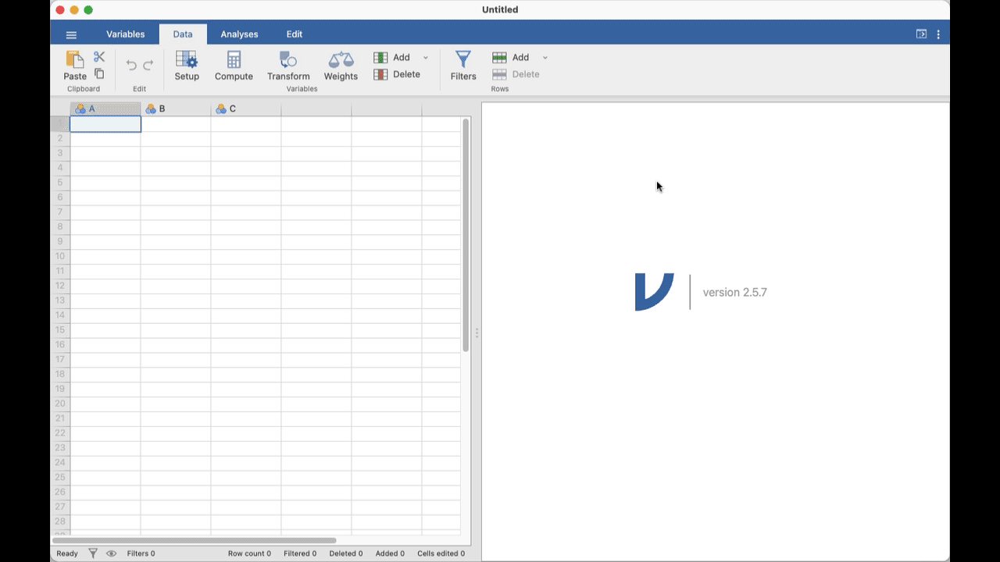

## Introduction {.unnumbered}

Welcome to the third and *final* practical for **Module 1**. Yes, time flies!

Today, you will use the sampling plan your group developed last week to collect data and answer your biological question. In the second half of the practical, you will choose a Module 2 project group and agree on how you will work together.

### Things to prepare {.unnumbered}

1. **Lecture 3a** covers the model assumptions and diagnostics that you will apply today. Please review it before the practical.
2. <i class="bi bi-journal-text me-1" aria-hidden="true"></i> **Lab notebook**. If you are (still) wondering why we ask you to keep one, many fields formally require clear records of what you did and why for auditing and accountability, including [research](https://en.wikipedia.org/wiki/Lab_notebook), [clinical work](https://www.ecfr.gov/current/title-21/chapter-I/subchapter-A/part-58), engineering (e.g. under [ISO 9001](https://www.iso.org/iso-9001-quality-management.html)), and finance. Not surprisingly, this is increasingly crucial in the age of AI. **Get into the habit now.**
3. Your **laptop computer**, as usual.
4. Your **sampling protocol** from the previous practical (last week).

### Learning outcomes {.unnumbered}

By the end of this practical, you should be able to:

:::::: {.learning-outcomes-table}
| Learning outcome | How you will practise it |
|---|---|
| Collect data in a **reproducible** manner. | Apply the sampling scheme your group developed in Week 2, using its agreed selection, measurement, uncertainty, and recording rules for each sampled image. |
| Tidy data in **Microsoft Excel** or an equivalent spreadsheet program, then visualise and analyse it in **Jamovi, R, or another statistical program**. | Organise and check your group’s data in a spreadsheet. Then fit the planned analysis in your chosen statistical program and plot the results. |
| Choose, fit, check, and **interpret** an appropriate statistical model. | Use the response and predictor variables from your Week 2 study design to fit an appropriate model, check whether your data meet its assumptions, and write short statistical and biological conclusions. |
:::::

### Resources for today {.unnumbered}

Keep these resources open as you work through the practical:

- [Intertidal site images](105-images.qmd)
- [Model fitting and assumptions](w03-model-fitting-assumptions.qmd)
- [R and Jamovi cheatsheets](../cheatsheets.qmd)

Relevant resources are linked within each task.

### Research groups

::: {.column-margin}
#### Need a group?

If you were absent last week or cannot join your original group, speak to a demonstrator at the beginning of the practical. They will help you join an established group. Do **not** work alone: this is a group-based practical.
:::

**You are now a small research group.** Your group is responsible for making and recording decisions about sampling, data preparation, analysis, and interpretation. **Treat your demonstrators as research advisers.** They can help you interpret a resource, check a decision, troubleshoot software, or work through a problem in your data. When you ask for help, explain your question, what you have tried, and where you are unsure.

Once your lab supervisor has explained the practical, you can get started. 

## Practical -- Part 1 (50 minutes)

In the first half of today’s practical, work with your group to collect and analyse data.

#### <i class="bi bi-pencil-square me-1" aria-hidden="true"></i> Task 1: Collect data using your sampling scheme {.student-task}

Before you begin, check that you all agree on:

1. your biological question;
2. the response and predictor variables;
3. which images or parts of images you will sample;
4. what counts as one sampling unit;
5. the measurement and uncertainty rules; and
6. how you will record and combine the data.

**Update your lab notebook so that everyone in your group can follow the plan.** Divide the sampling work according to your group’s plan, then start collecting data. If it would help your group trace or resolve a later measurement, **note who sampled each image or unit** by including a name column in your final spreadsheet.

::: {.column-margin}
**Resources:** Check the [study-design template](https://docs.google.com/document/d/1JhSevrzpLlDsD0a4225h_dcC4i5ZOII7dkTr8u4gCgs/edit#heading=h.rc1vfwuebyac) and the [intertidal site images](105-images.qmd) if you need to refresh your memory about your sampling scheme. You can download the images from Canvas.
:::

#### Start collecting data from images

You may record observations directly in a shared spreadsheet or combine notebook records into one sheet when you complete your sampling.

If you run into a problem at this stage, speak with a demonstrator, who may be able to suggest a change. Record any agreed change in your notebook, then keep going.

::: {.column-margin}
**What a demonstrator can help with:** an ambiguous measurement (for example, a species you cannot identify clearly), a protocol that cannot be applied as written, or a proposed change to your sampling scheme.
:::

#### <i class="bi bi-pencil-square me-1" aria-hidden="true"></i> Task 2: Tidy and visualise your data {.student-task}

At this stage, make sure the spreadsheet is ready for analysis. Use the following as a checklist; depending on your data and how you import it into Jamovi or R, not every item will require changes:

- each row represents one sampling unit or observation;
- each column represents one variable;
- variable names and units are clear;
- labels, codes, and missing values are recorded consistently; and
- recorded values follow the measurement rules in your sampling scheme.

::: {.column-margin}
**Resources:** Check the [cheatsheets](../cheatsheets.qmd) for tips on tidying and plotting data in Jamovi or R.
:::

When ready, make a plot that answers your biological question and clearly shows the relationship between your response and predictor variables. You may need to transform your data or choose a different plot type to make the pattern clearer. If you are unsure, ask a demonstrator for advice. **Export the plot as an image: you will submit it to Canvas at the end of the practical.**

#### <i class="bi bi-pencil-square me-1" aria-hidden="true"></i> Task 3: Fit, check, and interpret a model {.student-task}

Use the response and predictor variables in your Week 2 study design to identify an appropriate, **simple** model. Keep the planned response--predictor relationship as your core analysis, and do **not** add extra predictors unless a demonstrator advises you to.

| Your response variable is... | Your predictor is... | Start with... |
|---|---|---|
| A continuous measurement | A categorical variable with two groups | An independent-samples *t*-test / general linear model |
| A continuous measurement | A categorical variable with three or more groups | A one-way ANOVA / general linear model |
| A continuous measurement | A continuous measurement | Linear regression / general linear model |
| Present/absent | A categorical or continuous variable | Logistic regression / generalised linear model -- **ask a demonstrator for help** |
| A count | A categorical or continuous variable | A count model / generalised linear model -- **ask a demonstrator for help** |
| Percent cover or a proportion | Any predictor | **Ask a demonstrator for help choosing an appropriate model** |

Fit the model in Jamovi, R, or another statistical program. If you are fitting a continuous-response general linear model, **use visual diagnostic plots to check its assumptions rather than relying only on formal tests** such as Shapiro--Wilk or Levene’s test. Discuss any concerns with a demonstrator.

::: {.column-margin}
#### General linear or generalised linear model?

For a continuous response, *t*-tests, ANOVA, and linear regression are all examples of a **general linear model**. Binary and count responses usually need a different family of models, called **generalised linear models**. Your demonstrators can help you choose and run these models in Jamovi.
:::

Before the practical ends, submit the Word document provided on Canvas. It should include:

1. your plot;
2. a short **statistical conclusion** that identifies the question, the pattern, and the supporting statistical evidence; and
3. a short **biological conclusion** that answers your biological question.

::: {.column-margin}
**What a demonstrator can help with:** choosing a model; explaining diagnostics (but not interpreting the results unless you try first); software problems; or helping you work through the interpretation of your results.
::::

:::: callout-note
### If you are using Jamovi

Please install the **GAMLj3** module in Jamovi. This gives you access to general, generalised, and mixed linear models:

1. Select the **Analyses** tab.
2. Click the **Modules** button and select **jamovi library**.
3. In the Available tab, search for **GAMLj3** and click **INSTALL**.

:::: {.content-visible unless-format="pdf"}
{#fig-install-gamj3.lightbox fig-alt="Animated screenshot showing how to install the GAMLj3 module from the Jamovi library."}
::::
::::

## Take a break!

Pack your bags and take a walk. In the second half of this practical, you will need to move around to join your project group, so be ready to do that.

## Practical -- Part 2 (30 minutes)

Your demonstrator will introduce the available projects, explain the relevant practical or ethics requirements, show you how Canvas group availability works, and help you decide where to seek further advice.

### Choose and join a Module 2 project group

1. Read the [Report 1 project catalogue](../module02/203-projects.qmd).
2. Choose an available project that interests you and that your group can realistically complete.
3. Join the corresponding Canvas group.
4. Gather with the students who joined that project group.

**We may not be able to place you and your friends in the same group because the number of available projects and places in each group is limited.** Treat this as a real-world scenario where you may need to work with colleagues you do not know well.

#### <i class="bi bi-pencil-square me-1" aria-hidden="true"></i> Final Task: Establish your group charter {.student-task}

Download the group-charter template. Work through it together to:

- exchange contact details;
- agree on roles, communication channels, and meeting arrangements;
- agree on a code of conduct;
- complete and sign the charter; and
- submit the completed charter individually on Canvas before you leave.

## End of practical notes

### Module 2 starts next week

Starting next week, Professor Clare McArthur will lead the Module 2 practicals.

### Attendance

Attendance will be taken towards the end of the practical. Please remind a demonstrator if it has not been recorded.
