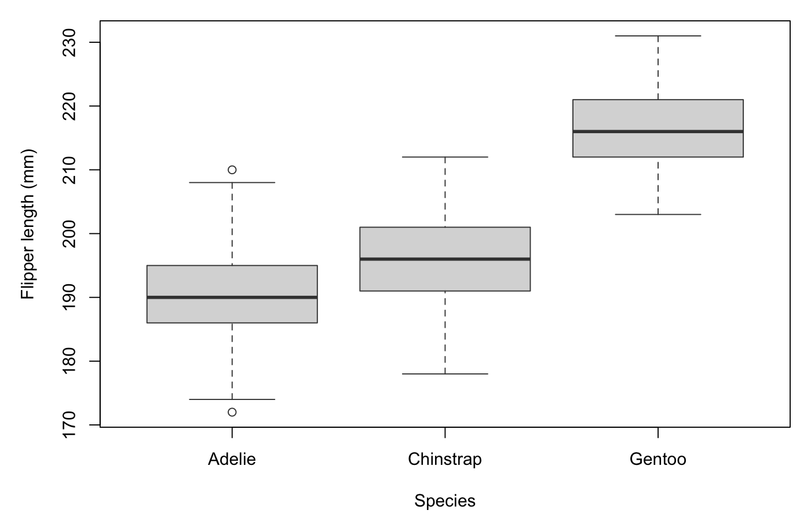

::: {.week-learning-path week="1"}
:::

This workshop gives you a short, guided introduction to the software and ideas you will use in Practical 1. You will reproduce one plot with a cheatsheet, connect it to the Week 1 lectures, and prepare a Model Card for the practical.

The class period is 45 minutes: a 40-minute core with 5 minutes of flex time for opening files, changing pages and getting support.

## [Optional]{.manual-activity-label} Before the timed workshop: optional survey {.manual-activity .is-optional #before-the-timed-workshop-optional-survey}

If your class survey is available, complete it while you are arriving. It helps us understand the class's statistical and software experience. It is not part of the timed workshop and should not delay your start if it is unavailable.

[Tue 2-4](https://docs.google.com/forms/d/e/1FAIpQLSf9eckurfxTqmPE5Pajm0s9biDq7HBDpPhCFaXJ1bqpfSeAbQ/viewform?usp=header) | 
[Wed 2-4](https://docs.google.com/forms/d/e/1FAIpQLSdkIV_MjseIoopyAFudXyKPYIMGPYzXxWpiiVkAOZJV_jIvzw/viewform?usp=header) | 
[Wed 4-6](https://docs.google.com/forms/d/e/1FAIpQLSes38rJmJ2kkBY3Q2r1Tn0MOdnLKqDXjJ6JriD-2c1ZLj0qIw/viewform?usp=header) | 
[Fri 2-4](https://docs.google.com/forms/d/e/1FAIpQLScn1h_2CSRDVsQFr-B6TgeVufH-kIdEBReY-xGYdjp2pAxTsA/viewform?usp=header) | 
[Fri 4-6](https://docs.google.com/forms/d/e/1FAIpQLSer7g_DS3q6OXtxmh8iQAtD21ghD4U1stoQj5MevGv2ukN0lw/viewform?usp=header)

## [Activity]{.manual-activity-label} Workshop activities {.manual-activity #workshop-activities}

### 1. Choose and open one software route — 4 minutes

**Complete one software route only.** Jamovi is recommended and is the best choice if you are new to statistical software. Use R only if you already have experience with it. SPSS remains supported, although we recommend Jamovi instead.

1. [Jamovi — recommended](#jamovi-route)
2. [R/RStudio — for students with prior R experience](#r-route)
3. [SPSS — supported alternative](#spss-route)

**Do this**: Open your chosen software. In class, tell the staff member at the demonstrator bench if you need a loan laptop; the staff member assigned to devices will issue one and help you reopen this page.

**Expected result**: Your chosen software opens to a blank analysis or data window.

**If this did not happen**: Use a loan laptop if one is available. If you still cannot access software, continue with the [supplied plot in Step 3](#fig-week1-guided-boxplot), record your software readiness as incomplete, and contact the teaching team through [Ed](https://edstem.org/au/courses/36475/). You may continue to Practical 1, but resolve software access before Practical 3.

### 2. Import and inspect the penguin data — 6 minutes

Download [penguins.csv](assets/penguins.csv). This is the dataset used by every route.

The file has 344 penguins and eight columns. Blank cells are expected: the source data contain 19 empty cells. Do not fill or repair them in Week 1. Software may report that incomplete cases were excluded from a particular plot.

#### Jamovi route {#jamovi-route}

**Do this**: In Jamovi, select the menu at the top left, then **Open > This PC > Browse** and choose `penguins.csv`. Find `species` and `flipper_length_mm` in the data table. Check that `species` is treated as a nominal variable and `flipper_length_mm` as a continuous variable.

**Expected result**: The data table opens with 344 rows. You can identify at least one categorical variable, such as `species`, and one continuous variable, such as `flipper_length_mm`.

**If this did not happen**: Check that you opened the downloaded `.csv` file rather than the webpage. If a variable has the wrong measurement level, select its column heading and change the measurement level in the variable setup panel.

[Continue to the Jamovi boxplot task](#jamovi-boxplot-route).

#### R route {#r-route}

This route assumes you have used R and RStudio before.

**Do this**: Put `penguins.csv` in your working directory, then run:

```r
penguins <- read.csv("penguins.csv")
str(penguins)
```

**Expected result**: R reports 344 observations of eight variables. `species` is a character variable and `flipper_length_mm` is numeric.

**If this did not happen**: In RStudio, use the Files pane to open the folder containing the CSV and choose **More > Set As Working Directory**, then run the two lines again.

[Continue to the R boxplot task](#r-boxplot-route).

#### SPSS route {#spss-route}

**Do this**: In SPSS, choose **File > Import Data > CSV Data**, select `penguins.csv`, and confirm that the first row contains variable names. Check `species` and `flipper_length_mm` in Variable View.

**Expected result**: Data View shows 344 cases. `species` is categorical and `flipper_length_mm` is numeric with a scale measurement level.

**If this did not happen**: Reopen the import dialog and confirm that commas separate the fields and the first row contains the variable names. Ask the device-support staff member for help if the University computer blocks the file picker.

[Continue to the SPSS boxplot task](#spss-boxplot-route).

*Progress check: you have imported the shared dataset and identified a categorical and a continuous variable.*

### 3. Use a cheatsheet to reproduce a boxplot — 12 minutes {#guided-boxplot}

We will address the question: **Does flipper length differ among penguin species?**

- response: `flipper_length_mm` (continuous)
- predictor: `species` (categorical)
- model: `flipper_length_mm ~ species`
- in words: flipper length is related to, or explained by, species

Continue with the same route you used in Step 2.

#### Jamovi boxplot {#jamovi-boxplot-route}

**Do this**: Open the [Jamovi boxplot cheatsheet](../cheatsheets.qmd#cheatsheet-jamovi-boxplot). In Jamovi, choose **Analyses > Exploration > Descriptives**. Move `flipper_length_mm` to **Variables**, move `species` to **Split by**, and select **Box plot** under **Plots**.

**Expected result**: You see three boxplots, one for each species, with flipper length on the vertical axis.

**If this did not happen**: Check that `flipper_length_mm` is continuous and `species` is nominal. If the plot is empty, return to the data table and confirm that the two columns contain values.

**Your software task is complete; [continue to Step 4](#connect-lecture).**

#### R boxplot {#r-boxplot-route}

**Do this**: Open the [R boxplot cheatsheet](../cheatsheets.qmd#cheatsheet-r-boxplot), then run:

```r
library(ggplot2)

ggplot(penguins, aes(x = species, y = flipper_length_mm)) +
  geom_boxplot() +
  labs(x = "Species", y = "Flipper length (mm)")
```

**Expected result**: You see three boxplots, one for each species, with labelled axes. R may report that rows containing missing values were removed.

**If this did not happen**: Confirm that the data object is named `penguins` and that the column names match the code exactly. Run `names(penguins)` to check them. If R reports that `ggplot2` is unavailable, use this base R version for today's task:

```r
boxplot(
  flipper_length_mm ~ species,
  data = penguins,
  xlab = "Species",
  ylab = "Flipper length (mm)"
)
```

You can install `ggplot2` after class.

**Your software task is complete; [continue to Step 4](#connect-lecture).**

#### SPSS boxplot {#spss-boxplot-route}

**Do this**: Open the [SPSS boxplot cheatsheet](../cheatsheets.qmd#cheatsheet-spss-boxplot). Choose **Graphs > Chart Builder**, select a simple boxplot, put `species` on the horizontal axis and `flipper_length_mm` on the vertical axis, then select **OK**.

**Expected result**: You see three boxplots, one for each species, with flipper length on the vertical axis.

**If this did not happen**: Return to Variable View and confirm that `species` is categorical and `flipper_length_mm` has a scale measurement level, then rebuild the chart.

**Your software task is complete; [continue to Step 4](#connect-lecture).**

Here is the expected plot. You may also use it for the remaining conceptual activities if software access is not yet available.

{#fig-week1-guided-boxplot fig-alt="Boxplots of flipper length for Adelie, Chinstrap and Gentoo penguins. Gentoo penguins have the highest median flipper length, Adelie penguins the lowest, and the groups overlap only slightly."}

If time permits, change one plot option and observe what happens. This is optional; you do not need to create a second software plot.

*Progress check: you have reproduced or examined the guided boxplot and can see three penguin species.*

### 4. Connect the lecture to the plot — 6 minutes {#connect-lecture}

**Do this**: Use the guided plot to answer these questions in a sentence or short note:

1. What biological comparison does the plot address?
2. Which variable is the response, and which is the predictor?
3. Which variable is continuous, and which is categorical?
4. Why is a boxplot suitable for these variables?
5. What does `flipper_length_mm ~ species` mean in words?

**Expected result**: You can explain that the plot compares a continuous response among categories of a predictor, and that the notation means flipper length is related to, or explained by, species.

**If this did not happen**: Review the response, predictor and model summary in [Step 3](#guided-boxplot). If you still need help, return to the [Week 1 lectures](../lectures/L01/index.qmd) and review the distinction between response and predictor variables. Then label the vertical axis as the response and the horizontal grouping variable as the predictor.

Choose one different pair for your Model Card:

- `body_mass_g ~ species` — boxplot;
- `bill_length_mm ~ sex` — boxplot; or
- `bill_length_mm ~ flipper_length_mm` — scatterplot.

By contrast, `species ~ island` is not suitable for either of today's boxplot or scatterplot choices because both variables are categorical.

### 5. Complete a Model Card — 8 minutes

**Do this**: Copy the template below into your lab notebook or an accessible digital document. Complete it using one of the three valid variable pairs above. Sketch the plot you would expect; producing a second plot in software is optional.

> **Biological question:**
>
> **Response and predictor:**
>
> **Variable types:**
>
> **Model, written as `y ~ x`:**
>
> **Model in words:** The response is related to, or explained by, the predictor.
>
> **Plot sketch:**
>
> **Software route or follow-up:** Record the Jamovi menu path, R command or SPSS route used. If you used the fallback, write “supplied plot used; software follow-up recorded”.
>
> **Limitation or unresolved question:**

You can begin the final line with **“This plot does not show…”** or **“I would need ___ before concluding…”**. For example, the plot might not account for body size, might compare groups of different sizes, or might omit incomplete cases. An observed association also does not establish causation.

**Expected result**: Your Model Card contains a measurable question, a correctly ordered response and predictor, matching variable types, a suitable plot sketch, and one careful limitation.

**If this did not happen**: Compare your variable pair with the three valid choices in Step 4. Check that a boxplot has a continuous response and categorical predictor, while a scatterplot has two continuous variables.

*Progress check: you have a distinct Model Card to take into Practical 1.*

### 6. Self-check or peer check — 4 minutes

**Do this**: Check your own Model Card or exchange it with another student. Answer yes or no to each item:

1. Does the biological question name a measurable relationship or comparison?
2. Are the response and predictor placed correctly in `y ~ x`?
3. Do the stated variable types match the selected columns?
4. Does the proposed plot suit those variable types?

**Expected result**: You can answer yes to all four items or identify one specific part to revise.

**If this did not happen**: Work through the four items independently and mark the first one that needs attention. Use the guided answer below to compare the structure, not to replace your distinct question.

#### Guided answer: flipper length and species

- **Biological question:** Does flipper length differ among penguin species?
- **Response and predictor:** `flipper_length_mm` is the response; `species` is the predictor.
- **Variable types:** continuous response; categorical predictor.
- **Model:** `flipper_length_mm ~ species`.
- **In words:** Flipper length is related to, or explained by, species.
- **Plot:** three boxplots, one for each species, as shown in @fig-week1-guided-boxplot.
- **Software route:** one of the three guided routes above.
- **Limitation:** The plot describes a difference among the sampled penguins but does not explain its cause or account for other traits such as body mass.

The six activities take 40 minutes. The remaining 5 minutes are flex time. If the class is running behind, skip the optional plot variation; do not skip the Model Card or readiness checks.

## [Activity]{.manual-activity-label} Readiness checkpoints {.manual-activity #readiness-checkpoints}

Before continuing to Practical 1, record both checks.

> **Conceptual readiness — required:** I can identify `y` and `x`, choose a plot that suits their variable types, and explain how it addresses my question.

> **Software readiness — complete or follow-up required:** I can open my chosen software, load the data and reproduce one plot using a cheatsheet. If not, I used the supplied plot, recorded follow-up, and will contact the teaching team through Ed. I will resolve software access before Practical 3.

Take your Model Card to [Practical 1](102-week01.qmd), where you will refine it or develop a new biological question.

## Software reference — not part of today's workshop

You do not need to work through this section during the workshop. It is here for installation and later reference.

### Jamovi — recommended

- [Download Jamovi](https://www.jamovi.org/download.html){target="_blank" rel="noopener noreferrer"}.
- Use the current release. On a Mac with Apple Silicon, choose the arm64 version.

Jamovi is the recommended starting point for students who are new to statistical software.

### R and RStudio — prior experience

- [Download R](https://cran.rstudio.com/){target="_blank" rel="noopener noreferrer"}.
- [Download RStudio Desktop](https://posit.co/download/rstudio-desktop/){target="_blank" rel="noopener noreferrer"}.
- If installation is not possible, experienced R users may consider [Posit Cloud](https://posit.cloud/){target="_blank" rel="noopener noreferrer"}.

Use this route only if you have worked with R before. R and RStudio are separate installations; run R through RStudio rather than the base R interface.

### SPSS — supported alternative

SPSS is available on University computers and through the University's [Citrix Workspace](https://uniconnect.cloud.com/Citrix/StoreWeb/#/login){target="_blank" rel="noopener noreferrer"}. We support SPSS, but recommend Jamovi for students choosing software for the first time.

### Other software

JASP and PSPP may be useful in other contexts, but they are not Workshop 1 routes. See [JASP materials](https://jasp-stats.org/jasp-materials/#manuals){target="_blank" rel="noopener noreferrer"} or the [PSPP website](https://www.gnu.org/software/pspp/){target="_blank" rel="noopener noreferrer"} if you already use them.

PRIMER v7 is used only for multivariate analysis in Module 3. It is available on University computers, and access guidance will be provided when it is needed.

### GitHub

GitHub is not required for today's workshop. It is used to share and improve open teaching resources. If you already have an account, you can follow the [USYD SOLES Open Educational Resources](https://github.com/usyd-soles-edu) and [BIOL2022](https://github.com/BIOL2022) organisations.

::: {.callout-note}
### Teaching staff: before class

Confirm that charged loan laptops are ready at the demonstrator bench, this page and the penguin data are bookmarked locally, course logins and the room network work, and one staff member is responsible for issuing devices.
:::
