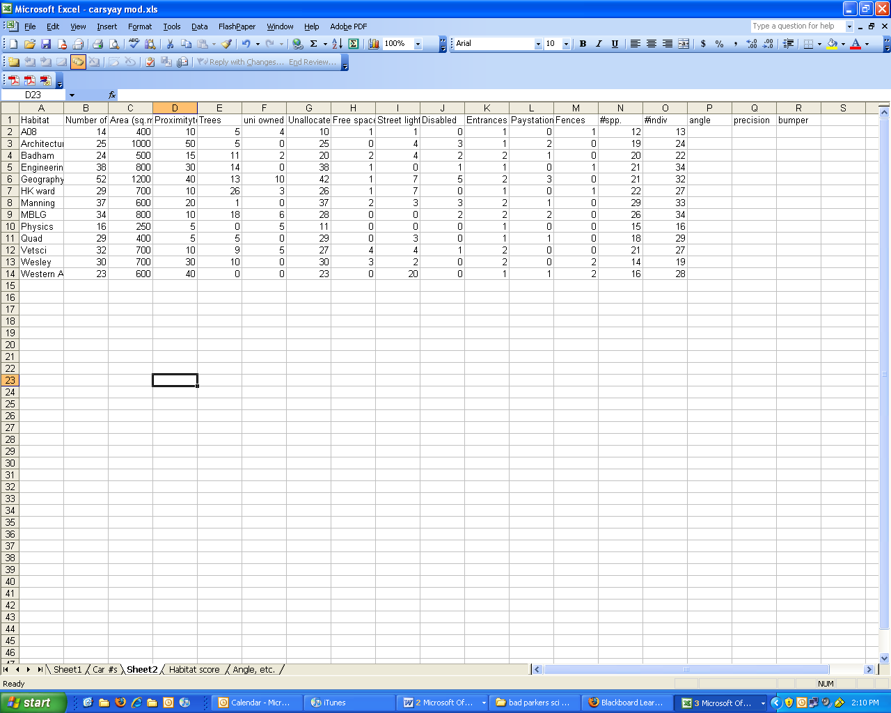
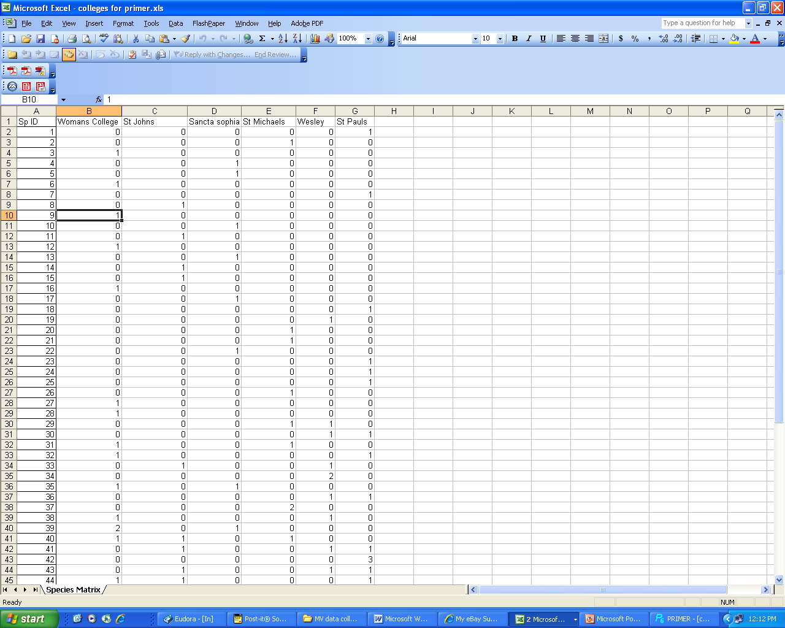

[Return to weekly content](../index.qmd#weekly-content)

:::{.callout-tip appearance="simple"}
## Objectives

The aim of this component of the practical series is to introduce you to several common techniques for analysing multivariate data. By the end of these practicals you will:

* Be familiar with the principles underpinning principal components analysis (PCA), cluster analysis and non-metric multidimensional scaling
* Understand multivariate hypothesis testing using permutational techniques
* Understand how experimental design affects multivariate analyses
* Know how to perform these analyses using **jamovi and the MISO module**
* Be able to interpret, present and report the results of multivariate analyses.

:::

For this specific practical you will:

* Present group presentations of model systems and experimental design.
* Analyse sample ecological data in **jamovi using MISO** to:
  * visualise assemblage structure using cluster analysis and nMDS;
  * test one- and two-factor multivariate hypotheses using ANOSIM and PERMANOVA;
  * assess multivariate dispersion using PERMDISP;
  * determine which variables contribute most to differences among groups using SIMPER.

These analyses are commonly used in ecology to compare species assemblages, visualise differences among groups, and test hypotheses about community composition.

## Analyses covered in practical 2

### nMDS and multivariate hypothesis testing

**(ANOSIM, PERMANOVA, PERMDISP, and SIMPER)**

These techniques are primarily used to:

* **Produce ordinations** (e.g. via nMDS) that visualise patterns in complex multivariate datasets by reducing their dimensionality
* **Test explicit hypotheses** about those patterns, based on **a priori groupings** (e.g., treatment types) or **relationships with predictor variables** (e.g., habitat characteristics)

These methods are particularly useful in ecological studies for comparing species assemblages and identifying patterns in community composition.

### ANOSIM – Analysis of Similarities

* ANOSIM tests for **differences in community composition** among predefined groups by comparing **within-group** and **between-group** similarities.
* It uses **distance-based rank comparisons** (e.g., Bray–Curtis).
* Best suited to **simple, one-factor experimental designs**.
* Output includes an **R statistic** and **p-value**, indicating the degree of group separation.

### PERMANOVA – Permutational multivariate analysis of variance

* PERMANOVA is a more flexible and **powerful method** for testing multivariate hypotheses using **permutation-based ANOVA** on a resemblance matrix.
* Capable of analysing **complex designs**, including:
  * Multiple fixed or random factors
  * Interactions and nested structures
* Appropriate for both **balanced** and **unbalanced** designs.

### PERMDISP – Permutational analysis of multivariate dispersions

* PERMANOVA tests for differences in assemblage **composition**. However, groups can also differ in how **variable or dispersed** their samples are.
* PERMDISP tests whether groups differ in their **multivariate dispersion** (the spread of samples within each group).
* If PERMDISP is significant, interpret the corresponding PERMANOVA results with additional caution.

### SIMPER – Similarity percentages

* SIMPER is used **after a significant difference** is found (e.g., via ANOSIM or PERMANOVA) to determine which **variables (e.g., species)** contribute most to differences between groups.
* It calculates the **average contribution** of each species to overall dissimilarity between groups.
* SIMPER is **descriptive**: a high contribution does not demonstrate that an individual species differs significantly between groups.
* Useful for interpreting **ecological drivers** behind observed multivariate patterns.

### Community and assemblage structure

A typical workflow for analysing community data is:

1. Arrange the data with **samples in rows** and species or other response variables in columns.
2. Apply an appropriate transformation to the species abundance data.
3. Calculate ecological dissimilarities, usually **Bray–Curtis** for abundance data.
4. Explore patterns using **nMDS** and/or cluster analysis.
5. Test hypotheses using **PERMANOVA** or, for simple one-factor questions, ANOSIM.
6. Use **PERMDISP** to assess whether groups differ in multivariate dispersion.
7. Use **SIMPER** where appropriate to identify species contributing most to differences among groups.

## Using jamovi and MISO

:::{.callout-important appearance="simple"}
### Install jamovi and the MISO module

Before the practical, make sure you have:

1. **jamovi** — download the current version from [jamovi.org](https://www.jamovi.org/).
2. The **MISO module** — download the latest MISO `.jmo` file from the [MISO releases page](https://github.com/usyd-soles-edu/miso/releases), then in jamovi go to **☰ → Modules → Install from file…** and select the downloaded file. If MISO is available in the jamovi library by the time you read this, you can install it from there instead (**Modules → jamovi library**).

If you have trouble installing MISO on your own machine, ask a demonstrator — the lab computers will have it set up.
:::

:::{.callout-note appearance="simple"}
### Video guides

Video walkthroughs of the MISO analyses below are being updated and will be added here soon.
:::

### 1. Open the data

Open **jamovi**, then select **Open → This PC**, and open the file:

[**Download AntDataTotal.csv**](assets/AntDataTotal.csv)

Each row in the dataset represents **one sample**. The first three variables are:

* **Site**
* **Community**
* **Sample**

These are followed by the ant abundance variables.

Check the variable types before starting the analyses:

* **Community** should be set to **Nominal**
* **Sample** should be set to **Nominal**
* All ant abundance variables should be set to **Continuous**

**Site** can be retained as an identifier.

For this dataset:

* **Community** has five levels
* **Sample** has two levels: **Edge** and **Interior**

### 2. Select the ant abundance variables

For the MISO community analyses, use **only the ant abundance variables** as the multivariate response data.

Place the ant abundance variables into:

**Feature Variables**

Do **not** include the following variables in **Feature Variables**:

* Site
* Community
* Sample

These variables have different roles:

* **Site** identifies individual sampling locations
* **Community** is a grouping factor
* **Sample** is a grouping factor distinguishing Edge and Interior samples

Your dataset should therefore be organised as:

* **Rows = samples**
* **Columns = species or taxa**
* **Additional columns = grouping factors and identifiers**

For example:

| Site    | Community   | Sample   | Species_A | Species_B | Species_C |
|---------|-------------|----------|-----------|-----------|-----------|
| Site01  | Community1  | Edge     | 3         | 0         | 12        |
| Site02  | Community1  | Interior | 1         | 2         | 7         |
| Site03  | Community2  | Edge     | 0         | 4         | 2         |

In the analyses that follow, you will normally place all of the **Species** columns into **Feature Variables**, while **Community** and/or **Sample** will be entered separately as grouping factors.

### 3. Transform the abundance data

Ecological abundance datasets are often dominated by a few very abundant species. Transforming the data reduces the influence of these dominant species and allows moderately abundant and less common species to contribute more to the analysis.

For this exercise, use:

**Transformation → Fourth root**

You do **not** need to create a separately transformed dataset. MISO applies the selected transformation as part of each analysis.

Other transformations that may be useful for your own data include:

* None
* Square root
* Fourth root
* Log(x + 1)
* Presence/absence

For this ant dataset, use the **fourth-root transformation** throughout the analyses below.

### 4. Select the Bray–Curtis dissimilarity

For these ant abundance data, use:

**Dissimilarity index → Bray-Curtis**

Bray–Curtis dissimilarity measures differences in species composition and abundance between samples and is widely used for ecological community data.

MISO calculates the dissimilarities automatically within each analysis. You therefore only need to specify:

* **Feature Variables** – the ant abundance variables
* **Transformation** – Fourth root
* **Dissimilarity index** – Bray-Curtis

Use these same settings throughout the analyses below unless instructed otherwise.

### 5. Create an nMDS ordination

Non-metric multidimensional scaling (**nMDS**) provides a visual representation of similarities and differences in ant assemblage composition among samples.

Go to:

**Analyses → MISO → nMDS**

**Set up the analysis**

**Feature Variables**

Move **all ant abundance variables** into **Feature Variables**.

**Grouping Variable**

Move **Community** into **Grouping Variable**.

**Analysis Choices**

Set:

* **Transformation → Fourth root**
* **Dissimilarity index → Bray-Curtis**

**Plots**

Keep the following selected:

* **Shepard Diagram**
* **Group point styling**

You can also select:

* **Group hulls**
* **Group dispersion ellipses**
* **Group spiders**

These additional options can help you visualise the separation and overlap among Communities.

**Random starts**

Set:

**Maximum random starts = 20**

**Interpret the nMDS**

In an nMDS plot:

* samples positioned **close together** have more similar ant assemblages;
* samples positioned **far apart** have more dissimilar ant assemblages.

Look for:

* separation among Communities;
* overlap among Communities;
* unusual or outlying samples;
* differences in the spread of samples within Communities.

Also examine the **stress value**. Lower stress indicates that the two-dimensional ordination provides a better representation of the multivariate relationships among samples.

**Important:** nMDS is primarily a visualisation technique. Do not conclude that Communities are significantly different simply because they appear separated on the plot. Formal tests of differences among Communities are conducted using ANOSIM and PERMANOVA.

### 6. Create a cluster analysis

Cluster analysis provides another way of visualising similarities among samples. Samples with more similar ant assemblages are grouped together in the dendrogram.

Go to:

**Analyses → MISO → Cluster analysis**

**Set up the analysis**

**Feature Variables**

Move **all ant abundance variables** into **Feature Variables**.

**Sample Labels**

Move **Site** into **Sample Labels** if you want individual samples identified on the dendrogram.

**Analysis Choices**

Set:

* **Transformation → Fourth root**
* **Dissimilarity index → Bray-Curtis**

**Interpret the cluster analysis**

Examine whether samples from the same **Community** tend to cluster together.

Compare the pattern in the dendrogram with the pattern you observed in the nMDS. The two approaches display the same underlying multivariate relationships in different ways.

### 7. Test for differences among Communities using ANOSIM

Analysis of Similarities (**ANOSIM**) tests whether assemblage composition differs among groups defined by a single factor.

For this analysis, the question is:

**Do ant assemblages differ among Communities?**

Go to:

**Analyses → MISO → ANOSIM**

**Set up the analysis**

**Feature Variables**

Move **all ant abundance variables** into **Feature Variables**.

**Grouping Variable**

Move **Community** into **Grouping Variable**.

**Analysis Choices**

Set:

* **Transformation → Fourth root**
* **Dissimilarity index → Bray-Curtis**

**Permutations**

Set:

**Permutations = 999**

Set:

**Permutation restriction → Free**

Because Community has more than two levels, select:

**Pairwise ANOSIM comparisons**

For multiple comparisons, use:

**P-value adjustment → Holm**

**Interpret the ANOSIM**

The two main results are:

* **Global R**
* **P-value**

The **Global R statistic** describes the degree of separation among Communities.

As a general guide:

* values near **0** indicate little separation among groups;
* larger positive values indicate greater separation;
* values approaching **1** indicate strong separation.

Use the **P-value** to determine whether there is statistical evidence that assemblage composition differs among Communities.

If the overall ANOSIM is significant, examine the pairwise comparisons to determine **which Communities differ from one another**.

An example of how to report the result is:

ANOSIM indicated that ant assemblage composition differed among Communities (Global R = ..., P = ..., 999 permutations).

### 8. Test Community and Sample effects using PERMANOVA

Permutational Multivariate Analysis of Variance (**PERMANOVA**) allows us to test more complex hypotheses involving multiple factors.

For AntDataTotal, we will test:

* **Community**
* **Sample**
* **Community × Sample**

These terms answer three different biological questions:

* **Community:** Does ant assemblage composition differ among Communities?
* **Sample:** Does ant assemblage composition differ between **Edge** and **Interior** samples?
* **Community × Sample:** Does the difference between Edge and Interior samples vary among Communities?

Go to:

**Analyses → MISO → PERMANOVA**

**Set up the analysis**

**Feature Variables**

Move **all ant abundance variables** into **Feature Variables**.

**Grouping Variable**

Move **Community** into **Grouping Variable**.

**Additional Factors**

Move **Sample** into **Additional Factors**.

**Analysis Choices**

Set:

* **Transformation → Fourth root**
* **Dissimilarity index → Bray-Curtis**

Select:

**Model Interactions**

This adds the **Community × Sample** interaction to the model.

**Permutations**

Set:

**Number of permutations = 999**

Set:

**Permutation restrictions → Free**

**Test type**

Select:

**Test type → Marginal terms**

This tests each term while accounting for the other terms in the model.

**Pairwise comparisons**

Select:

**Pairwise comparisons**

Set:

**P-value adjustment → Holm**

**Interpret the PERMANOVA**

Examine the PERMANOVA results for:

* **Community**
* **Sample**
* **Community × Sample**

For each term, examine:

* degrees of freedom (**df**);
* **pseudo-F** statistic;
* **R²** or variance explained, where provided;
* **P-value**.

Interpret the effects as follows:

* A significant **Community** effect indicates that ant assemblage composition differs among Communities.
* A significant **Sample** effect indicates that assemblage composition differs between Edge and Interior samples overall.
* A significant **Community × Sample** interaction indicates that the difference between Edge and Interior samples varies among Communities.

**Important:** If the **Community × Sample interaction is significant**, examine and interpret the interaction before drawing conclusions about the main effects of Community or Sample.

### 9. Check multivariate dispersion using PERMDISP

PERMANOVA tests for differences in multivariate assemblage composition. However, groups can also differ in how variable or dispersed their samples are.

**PERMDISP** tests whether Communities differ in their multivariate dispersion.

Go to:

**Analyses → MISO → PERMDISP**

**Set up the analysis**

**Feature Variables**

Move **all ant abundance variables** into **Feature Variables**.

**Grouping Variable**

Move **Community** into **Grouping Variable**.

**Analysis Choices**

Set:

* **Transformation → Fourth root**
* **Dissimilarity index → Bray-Curtis**
* **Group centre → Median**
* **Permutations = 999**

Keep:

**Distance-to-centre diagnostic**

selected.

You may also select:

**Pairwise dispersion comparisons**

if the overall PERMDISP test is significant.

**Interpret PERMDISP**

A **non-significant PERMDISP** result indicates that there is no evidence that the Communities differ in their multivariate dispersion.

A **significant PERMDISP** result indicates that at least some Communities differ in their multivariate spread.

If PERMDISP is significant, interpret the PERMANOVA result with additional caution and examine the nMDS and distance-to-centre plot to understand the pattern.

### 10. Identify contributing species using SIMPER

Similarity Percentages (**SIMPER**) helps identify which species contribute most to the average differences in assemblage composition among Communities.

SIMPER is primarily a **descriptive follow-up analysis**.

Go to:

**Analyses → MISO → SIMPER**

**Set up the analysis**

**Feature Variables**

Move **all ant abundance variables** into **Feature Variables**.

**Grouping Variable**

Move **Community** into **Grouping Variable**.

**Transformation**

Select:

**Fourth root**

**Output settings**

Set:

* **Top N features = 10**
* **Cumulative contribution = 70%**

You may also select:

* **Contribution plots**
* **Contrast overview heatmap**
* **Detailed Statistics**

**Interpret SIMPER**

For each pair of Communities, identify the species that make the largest contributions to the average Bray–Curtis dissimilarity.

Species with larger contributions are more important in explaining the observed compositional difference between those two Communities.

**Important:** SIMPER is descriptive. A high SIMPER contribution does **not** demonstrate that an individual species differs significantly between Communities.

### 11. Analysis sequence for AntDataTotal

Complete the analyses in the following order:

| Step | Analysis         | Main settings                                                                                     |
|------|------------------|---------------------------------------------------------------------------------------------------|
| 1    | nMDS             | Fourth root; Bray–Curtis; Group = Community                                                       |
| 2    | Cluster analysis | Fourth root; Bray–Curtis; Labels = Site                                                           |
| 3    | ANOSIM           | Community; 999 permutations                                                                       |
| 4    | PERMANOVA        | Community + Sample + Community × Sample; 999 permutations; Marginal terms                         |
| 5    | PERMDISP         | Community; 999 permutations                                                                       |
| 6    | SIMPER           | Community; Fourth root                                                                            |

This sequence takes you through four stages of multivariate analysis:

**Visualise patterns → Test hypotheses → Check dispersion → Identify contributing species**

### 12. Prepare your own assemblage or community data

For your own community dataset, organise your spreadsheet so that:

* **Rows = sampling units or sites**
* **Columns = species or taxa**
* **Additional columns = factors and identifiers**

For example:

| Site   | Community   | Sample   | Species_A | Species_B | Species_C |
|--------|-------------|----------|-----------|-----------|-----------|
| Site01 | Community1  | Edge     | 3         | 0         | 12        |
| Site02 | Community1  | Interior | 1         | 2         | 7         |
| Site03 | Community2  | Edge     | 0         | 4         | 2         |

Each species abundance column should contain **numbers only**.

Use **0** where a species was genuinely absent from a surveyed sample.

Do **not** use 0 to represent missing data or a sample that was not surveyed.

Remove species that are absent from **every sample**.

Avoid:

* merged cells;
* multiple header rows;
* totals or subtotals within the community matrix;
* text entries within abundance columns.

When the file is opened in jamovi, check that:

* grouping variables such as **Community** and **Sample** are set to **Nominal**;
* species abundance variables are set to **Continuous**.

### 13. Prepare data for next week's practical

By the **start of next week's practical**, each group must have **three spreadsheets** prepared. These will be checked and **marked out of 5** by your demonstrators.

#### 1. Habitat data file

Prepare the habitat data for analysis in **jamovi or R**.

Your spreadsheet should have:

* **Rows = sites**
* **Columns = habitat variables**

Also include:

* a **Site** column;
* a **Community** column if relevant;
* clear and meaningful variable names;
* consistent measurement units.

Before the practical, check the dataset carefully for missing values.

Habitat variables that will be used in **PCA** should be numeric.

#### 2. Assemblage / community data file

Prepare the community data for analysis in **jamovi/MISO or R**.

Your spreadsheet should have:

* **Rows = sampling units or sites**
* **Columns = species or taxa**

Also include:

* a **Site** identifier;
* a **Community** column;
* any other relevant grouping factors, such as **Sample**;
* numeric abundance or presence/absence values.

Before the practical:

* remove taxa that are absent from all samples;
* check that abundance columns contain numbers only;
* check that **Community**, **Sample**, and other grouping factors are recognised as **Nominal** variables in jamovi;
* check that species abundance variables are recognised as **Continuous**.

#### 3. Summary statistics file

Prepare a separate spreadsheet containing useful summary variables.

These may include:

* **number of species per site**;
* **total abundance per site**;
* **mean or median habitat variables**;
* other summary measures relevant to your research question.

These summaries can be calculated for individual sites or grouped by variables such as:

* **Community**;
* **Sample**;
* another biologically relevant grouping variable.

## Important note about transformations

MISO allows multivariate analyses to be run on **untransformed data**. However, ecological abundance datasets are often strongly influenced by a small number of highly abundant taxa.

A transformation can reduce the influence of dominant species and allow moderately abundant and less common species to contribute more to the multivariate pattern.

For this practical, use:

**Transformation → Fourth root**

The fourth-root transformation reduces the influence of very abundant species while still retaining information about differences in abundance among samples.

For your own datasets, the most appropriate transformation will depend on your biological question and the structure of your data. You may therefore compare alternatives such as:

* None
* Square root
* Fourth root
* Log(x + 1)
* Presence/absence

When comparing transformations, consider whether the biological interpretation of the results changes and which transformation best reflects the question you are trying to answer.

## Example data sheets

{fig-alt="Spreadsheet layout showing a jamovi-ready data sheet for PCA."}

{fig-alt="Spreadsheet layout showing a jamovi-ready community data sheet for MISO analyses."}
