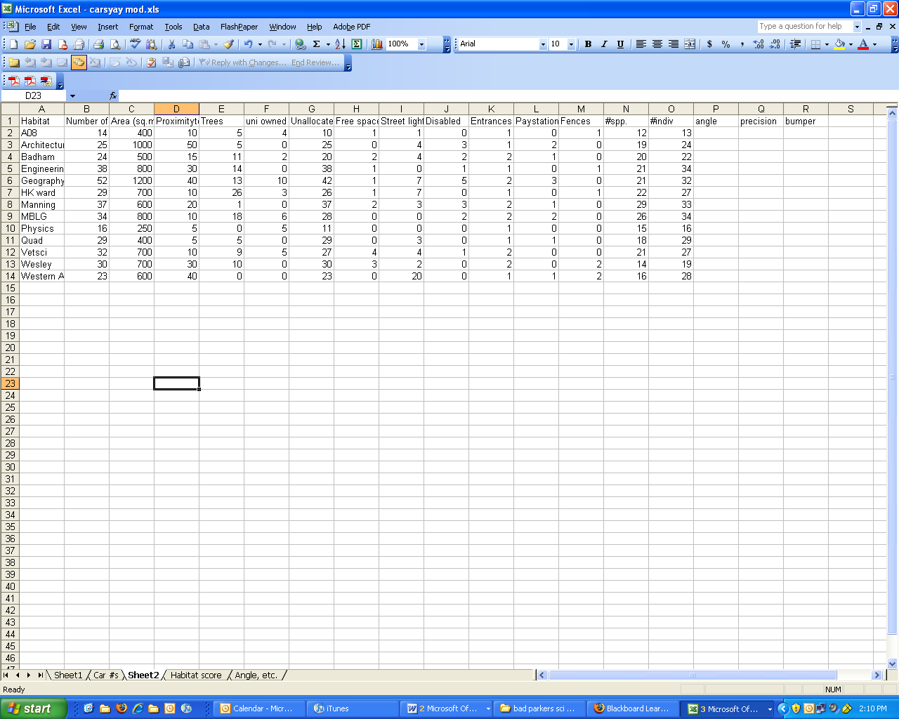
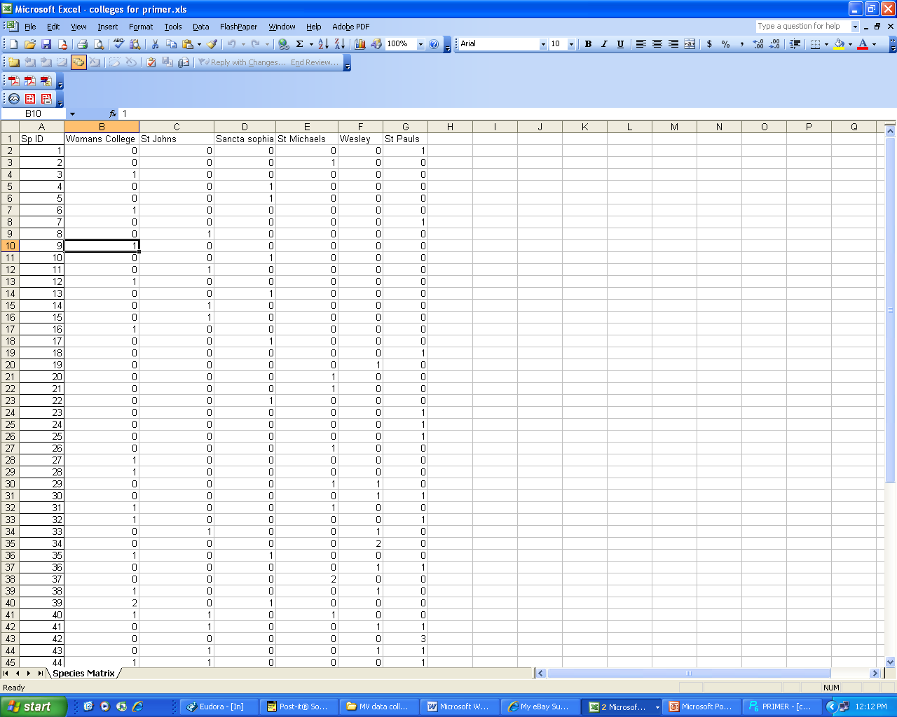

::: {.border .rounded .p-3 .mb-4 .bg-body-tertiary}
**Module 3 objectives**

This module introduces widely used techniques for analysing multivariate biological data. By the end of this module, you will be able to:

- Understand the principles underlying **Principal Components Analysis (PCA)** and **Non-metric Multidimensional Scaling (nMDS)**
- Be familiar with the concepts behind **multivariate hypothesis testing** using **permutational techniques** such as **ANOSIM** and **PERMANOVA**
- Be able to **plan and conduct experiments** that test multivariate hypotheses
- Know how to **carry out these analyses using relevant statistical software**
- Be able to **interpret, present, and report** your findings clearly and effectively

:::

## Introduction

For this practical you will:

- Present group presentations of model systems and experimental design.
- Analyse sample ecological data in jamovi using *miso* to:
  - Visualise assemblage structure using cluster analysis and nMDS.
  - Test one- and two-factor multivariate hypotheses using ANOSIM and PERMANOVA.
  - Assess multivariate dispersion using PERMDISP.
  - Determine which variables contribute most to differences among groups using SIMPER.

These analyses are commonly used in ecology to compare species assemblages, visualise differences among groups, and test hypotheses about community composition.

### Community and assemblage structure

A typical workflow for analysing community data is:

1. Arrange the data with **samples in rows** and species or other response variables in columns.
2. Apply an appropriate transformation to the species abundance data.
3. Calculate ecological dissimilarities, usually **Bray–Curtis** for abundance data.
4. Explore patterns using **nMDS** and/or cluster analysis.
5. Test hypotheses using **PERMANOVA** or, for simple one-factor questions, ANOSIM.
6. Use **PERMDISP** to assess whether groups differ in multivariate dispersion.
7. Use **SIMPER** where appropriate to identify species contributing most to differences among groups.

## Using jamovi and *miso*

In this practical, we will use *miso* (Multivariate Inference, Similarity and Ordination) to analyse the ant community data in jamovi.

Install or update *miso* using the [installation instructions in the week 9 practical](302-week09.qmd#install-miso) before continuing.

### Understand the data

Each row is one sample. The first three columns describe where it came from:

- **Site** identifies the sampling site.
- **Community** has five levels.
- **Sample** is either **Edge** or **Interior**.

The remaining 100 columns contain ant abundance data. Keep **Site** as an identifier, but leave it out of the analyses.

### Open the data

1. Download [AntDataTotal.csv](assets/AntDataTotal.csv) to your computer.
2. In jamovi, select **☰ menu → Open → This PC → Browse**, find the downloaded file and select **Open**.

### Check the variable types

Before starting the analyses, check that **Community** and **Sample** are set to **Nominal**. If needed, double-click the column heading and change **Measure type**.

Set the 100 ant abundance variables to **Continuous** together:

1. Select the **Variables** tab and use the select-all checkbox.
2. Deselect **Site**, **Community** and **Sample**.
3. Set **Measure type → Continuous**.

### Ant abundance variables

For the *miso* community analyses, use **only the ant abundance variables** as the multivariate response data.

In each analysis, place the ant abundance variables into **Feature Variables**. Do **not** include **Site**, **Community** or **Sample**. These variables have different roles:

* **Site** identifies individual sampling locations.
* **Community** is a grouping factor.
* **Sample** is a grouping factor distinguishing **Edge** and **Interior** samples.

The supplied dataset is already organised with:

* **Rows = samples**
* **Columns = species or taxa**
* **Additional columns = grouping factors and identifiers**

For example:

| Site | Community | Sample | Species_A | Species_B | Species_C |
|------|-----------|--------|-----------|-----------|-----------|
| Site01 | Community1 | Edge | 3 | 0 | 12 |
| Site02 | Community1 | Interior | 1 | 2 | 7 |
| Site03 | Community2 | Edge | 0 | 4 | 2 |

This structure keeps the species abundance data separate from the variables that identify samples and define groups. Use the same structure when preparing your own community dataset.

In the analyses that follow, place all of the **ant abundance columns** into **Feature Variables**, while **Community** and/or **Sample** will be entered separately as grouping factors.

### Transformation settings

Ecological abundance datasets are often dominated by a few very abundant species. Transforming the data reduces the influence of these dominant species and allows moderately abundant and less common species to contribute more to the analysis.

For this exercise, use:

**Transformation → Fourth root**

You do **not** need to create a separately transformed dataset. *miso* applies the selected transformation as part of each analysis.

For your own data, other transformation choices that may be useful include:

* None
* Square root
* Fourth root
* Log(x + 1)
* Presence/absence

For this ant dataset, use the **fourth-root transformation** throughout the analyses below.

### Dissimilarity settings

For these ant abundance data, use:

**Dissimilarity index → Bray-Curtis**

Bray–Curtis dissimilarity measures differences in species composition and abundance between samples and is widely used for ecological community data.

*miso* calculates the dissimilarities automatically within each analysis. You therefore only need to specify:

* **Feature Variables** – the ant abundance variables
* **Transformation** – Fourth root
* **Dissimilarity index** – Bray-Curtis

These settings are selected within each analysis, after opening it. They are not separate data-processing steps.

Use these same settings throughout the analyses below unless instructed otherwise.

### Analysis sequence for AntDataTotal

Complete the analyses in the following order:

| Step | Analysis | Main settings |
|------|----------|---------------|
| 1 | nMDS | Fourth root; Bray–Curtis; Group = Community |
| 2 | Cluster analysis | Fourth root; Bray–Curtis; Labels = Site |
| 3 | ANOSIM | Community; 999 permutations |
| 4 | PERMANOVA | Community × Sample interaction; marginal terms; 999 permutations; pairwise Community comparisons within Edge and Interior |
| 5 | PERMDISP | Community; 999 permutations |
| 6 | SIMPER | Community; Fourth root |

This sequence takes you through four stages of multivariate analysis:

**Visualise patterns → Test hypotheses → Check dispersion → Identify contributing species**

## 1. nMDS
### Create an nMDS ordination

Non-metric multidimensional scaling (**nMDS**) provides a visual representation of similarities and differences in ant assemblage composition among samples.

### Set up the analysis

1. Select **Analyses → Multivariate → nMDS**.
2. Move **all ant abundance variables** into **Feature Variables**.
3. Move **Community** into **Grouping Variable**.
4. Under **Analysis Choices**, set:
   - **Transformation → Fourth root**
   - **Dissimilarity index → Bray-Curtis**
5. Under **Plots**, keep the following selected:
   - **Shepard Diagram**
   - **Group point styling**

   **Optional:** You can also select:
   - **Group hulls**
   - **Group dispersion ellipses**
   - **Group spiders**

   These additional options can help you visualise the separation and overlap among Communities.
6. Set **Maximum random starts = 20**.

### Read the output

In an nMDS plot:

* samples positioned **close together** have more similar ant assemblages;
* samples positioned **far apart** have more dissimilar ant assemblages.

Look for:

* separation among Communities;
* overlap among Communities;
* unusual or outlying samples;
* differences in the spread of samples within Communities.

Also examine the **stress value**. Lower stress indicates that the two-dimensional ordination provides a better representation of the multivariate relationships among samples.

**Important:** nMDS is primarily a visualisation technique. Do not conclude that Communities are significantly different simply because they appear separated on the plot. Formal tests of differences among Communities are conducted using ANOSIM and PERMANOVA.

## 2. Cluster analysis
### Create a cluster analysis

Cluster analysis provides another way of visualising similarities among samples. Samples with more similar ant assemblages are grouped together in the dendrogram.

### Set up the analysis

1. Select **Analyses → Multivariate → Cluster analysis**.
2. Move **all ant abundance variables** into **Feature Variables**.
3. **Optional:** Move **Site** into **Sample Labels** if you want individual samples identified on the dendrogram.
4. Under **Analysis Choices**, set:
   - **Transformation → Fourth root**
   - **Dissimilarity index → Bray-Curtis**.

### Read the output

Examine whether samples from the same **Community** tend to cluster together.

Compare the pattern in the dendrogram with the pattern you observed in the nMDS. The two approaches display the same underlying multivariate relationships in different ways.

## 3. ANOSIM
### Test for differences among Communities using ANOSIM

Analysis of Similarities (**ANOSIM**) tests whether assemblage composition differs among groups defined by a single factor.

For this analysis, the question is:

**Do ant assemblages differ among Communities?**

### Set up the analysis

1. Select **Analyses → Multivariate → ANOSIM**.
2. Move **all ant abundance variables** into **Feature Variables**.
3. Move **Community** into **Grouping Variable**.
4. Under **Analysis Choices**, set:
   - **Transformation → Fourth root**
   - **Dissimilarity index → Bray-Curtis**
5. Set **Permutations = 999**.
6. Set **Permutation restriction → Free**.
7. Because Community has more than two levels, select **Pairwise ANOSIM comparisons**.
8. For multiple comparisons, set **P-value adjustment → Holm**.

### Read the output

The two main results are:

* **Global R**
* **P-value**

The **Global R statistic** describes the degree of separation among Communities.

As a general guide:

* values near **0** indicate little separation among groups;
* larger positive values indicate greater separation;
* values approaching **1** indicate strong separation.

Use the **P-value** to determine whether there is statistical evidence that assemblage composition differs among Communities.

If the overall ANOSIM is significant, examine the pairwise comparisons to determine **which Communities differ from one another**.

An example of how to report the result is:

ANOSIM indicated that ant assemblage composition differed among Communities (Global R = ..., P = ..., 999 permutations).

## 4. PERMANOVA
### Test Community and Sample effects using PERMANOVA

Permutational Multivariate Analysis of Variance (**PERMANOVA**) allows us to test more complex hypotheses involving multiple factors.

For AntDataTotal, we will fit a model containing:

* **Community**
* **Sample**
* **Community × Sample**

These terms represent three biological questions:

* **Community:** Does ant assemblage composition differ among Communities?
* **Sample:** Does ant assemblage composition differ between **Edge** and **Interior** samples?
* **Community × Sample:** Does the difference between Edge and Interior samples vary among Communities?

In this exercise, we use **marginal terms** to test the interaction. Community and Sample remain in the model, but are not tested separately while their interaction is included.

### Set up the analysis

1. Select **Analyses → Multivariate → PERMANOVA**.
2. Move **all ant abundance variables** into **Feature Variables**.
3. Move **Community** into **Grouping Variable**.
4. Move **Sample** into **Additional Factors**, then select **Model interactions** beneath it.
5. Under **Analysis Choices**, set:
   - **Transformation → Fourth root**
   - **Dissimilarity index → Bray-Curtis**
   - **Permutation restrictions → Free**
   - **Test type → Marginal terms**
6. Select **Pairwise comparisons** and set **P-value adjustment → Holm**.
7. Under **Reproducibility and Technical Settings**, set **Number of permutations = 999**.

Leave **Blocking Variable** and **Continuous Covariates** empty for this exercise. Keep **Binary (presence/absence)** and **Square-root distances** unchecked, and **Additive constant → None**.

::: {.panel-tabset}

#### Default

#### Warm tint

:::

**Video note:** This recording finishes with a model without interactions. Follow the written settings above for this exercise.

### Read the output

Read the **Community × Sample** row in the PERMANOVA results. Examine:

* degrees of freedom (**df**);
* **pseudo-F** statistic;
* **R²** or variance explained, where provided;
* **P-value**.

A significant interaction indicates that the difference between Edge and Interior assemblages varies among Communities.

**Community** and **Sample** are not shown as separate tests because they are included in the interaction. Their absence does not mean that their effects are non-significant.

### Read the pairwise results

The pairwise tables compare Communities separately within **Edge** and **Interior** samples. These are conditional comparisons: for example, BGHF versus CCIF within Edge samples.

Use **Adjusted p** to assess each comparison. Holm adjustment covers all 20 planned comparisons across both tables. Each comparison uses only the samples belonging to that pair of Communities and Sample level.

These tables do **not** compare Edge against Interior within each Community. A comparison marked **not estimated** could not be tested; do not interpret it as non-significant.

### Report the analysis

For example:

“The Community × Sample interaction was [significant/not significant] (pseudo-F = …, df = …, permutation p = …). The analysis used fourth-root-transformed abundances, Bray–Curtis dissimilarities, marginal terms and … permutations (seed = …).”

Use the permutation count and seed shown in your output. When reporting pairwise results, identify the Sample level and give the adjusted p-value.

## 5. PERMDISP
### Check multivariate dispersion using PERMDISP

PERMANOVA tests for differences in multivariate assemblage composition. However, groups can also differ in how variable or dispersed their samples are.

**PERMDISP** tests whether Communities differ in their multivariate dispersion.

### Set up the analysis

1. Select **Analyses → Multivariate → PERMDISP**.
2. Move **all ant abundance variables** into **Feature Variables**.
3. Move **Community** into **Grouping Variable**.
4. Under **Analysis Choices**, set:
   - **Transformation → Fourth root**
   - **Dissimilarity index → Bray-Curtis**
   - **Group centre → Median**
   - **Permutations = 999**
5. Keep **Distance-to-centre diagnostic** selected.
6. **Conditional:** You may also select **Pairwise dispersion comparisons** if the overall PERMDISP test is significant.

### Read the output

A **non-significant PERMDISP** result indicates that there is no evidence that the Communities differ in their multivariate dispersion.

A **significant PERMDISP** result indicates that at least some Communities differ in their multivariate spread.

If PERMDISP is significant, interpret the PERMANOVA result with additional caution and examine the nMDS and distance-to-centre plot to understand the pattern.

## 6. SIMPER
### Identify contributing species using SIMPER

Similarity Percentages (**SIMPER**) helps identify which species contribute most to the average differences in assemblage composition among Communities.

SIMPER is primarily a **descriptive follow-up analysis**.

### Set up the analysis

1. Select **Analyses → Multivariate → SIMPER**.
2. Move **all ant abundance variables** into **Feature Variables**.
3. Move **Community** into **Grouping Variable**.
4. Under **Transformation**, select **Fourth root**.
5. Under **Output settings**, set:
   - **Top N features = 10**
   - **Cumulative contribution = 70%**

   **Optional:** You may also select:
   - **Contribution plots**
   - **Contrast overview heatmap**
   - **Detailed Statistics**.

### Read the output

For each pair of Communities, identify the species that make the largest contributions to the average Bray–Curtis dissimilarity.

Species with larger contributions are more important in explaining the observed compositional difference between those two Communities.

**Important:** SIMPER is descriptive. A high SIMPER contribution does **not** demonstrate that an individual species differs significantly between Communities.

## Prepare your own assemblage or community data

For your own community dataset, organise your spreadsheet so that:

* **Rows = sampling units or sites**
* **Columns = species or taxa**
* **Additional columns = factors and identifiers**

For example:

| Site   | Community   | Sample   | Species_A | Species_B | Species_C |
|--------|-------------|----------|-----------|-----------|-----------|
| Site01 | Community1  | Edge     | 3         | 0         | 12        |
| Site02 | Community1  | Interior | 1         | 2         | 7         |
| Site03 | Community2  | Edge     | 0         | 4         | 2         |

Each species abundance column should contain **numbers only**.

Use **0** where a species was genuinely absent from a surveyed sample.

Do **not** use 0 to represent missing data or a sample that was not surveyed.

Remove species that are absent from **every sample**.

Avoid:

* merged cells;
* multiple header rows;
* totals or subtotals within the community matrix;
* text entries within abundance columns.

When the file is opened in jamovi, check that:

* grouping variables such as **Community** and **Sample** are set to **Nominal**;
* species abundance variables are set to **Continuous**.

## Prepare data for next week's practical

By the **start of next week's practical**, each group must have **three spreadsheets** prepared. These will be checked and **marked out of 5** by your demonstrators.

### Habitat data file

Prepare the habitat data for analysis in **jamovi or R**.

Your spreadsheet should have:

* **Rows = sites**
* **Columns = habitat variables**

Also include:

* a **Site** column;
* a **Community** column if relevant;
* clear and meaningful variable names;
* consistent measurement units.

Before the practical, check the dataset carefully for missing values.

Habitat variables that will be used in **PCA** should be numeric.

### Assemblage / community data file

Prepare the community data for analysis in **jamovi/*miso* or R**.

Your spreadsheet should have:

* **Rows = sampling units or sites**
* **Columns = species or taxa**

Also include:

* a **Site** identifier;
* a **Community** column;
* any other relevant grouping factors, such as **Sample**;
* numeric abundance or presence/absence values.

Before the practical:

* remove taxa that are absent from all samples;
* check that abundance columns contain numbers only;
* check that **Community**, **Sample**, and other grouping factors are recognised as **Nominal** variables in jamovi;
* check that species abundance variables are recognised as **Continuous**.

### Summary statistics file

Prepare a separate spreadsheet containing useful summary variables.

These may include:

* **number of species per site**;
* **total abundance per site**;
* **mean or median habitat variables**;
* other summary measures relevant to your research question.

These summaries can be calculated for individual sites or grouped by variables such as:

* **Community**;
* **Sample**;
* another biologically relevant grouping variable.

## Important note about transformations

*miso* allows multivariate analyses to be run on **untransformed data**. However, ecological abundance datasets are often strongly influenced by a small number of highly abundant taxa.

A transformation can reduce the influence of dominant species and allow moderately abundant and less common species to contribute more to the multivariate pattern.

For this practical, use:

**Transformation → Fourth root**

The fourth-root transformation reduces the influence of very abundant species while still retaining information about differences in abundance among samples.

For your own datasets, the most appropriate transformation will depend on your biological question and the structure of your data. You may therefore compare alternatives such as:

* None
* Square root
* Fourth root
* Log(x + 1)
* Presence/absence

When comparing transformations, consider whether the biological interpretation of the results changes and which transformation best reflects the question you are trying to answer.

## Example data sheets

{fig-alt="Spreadsheet layout showing a jamovi-ready data sheet for PCA."}

{fig-alt="Spreadsheet layout showing a jamovi-ready community data sheet for miso analyses."}
